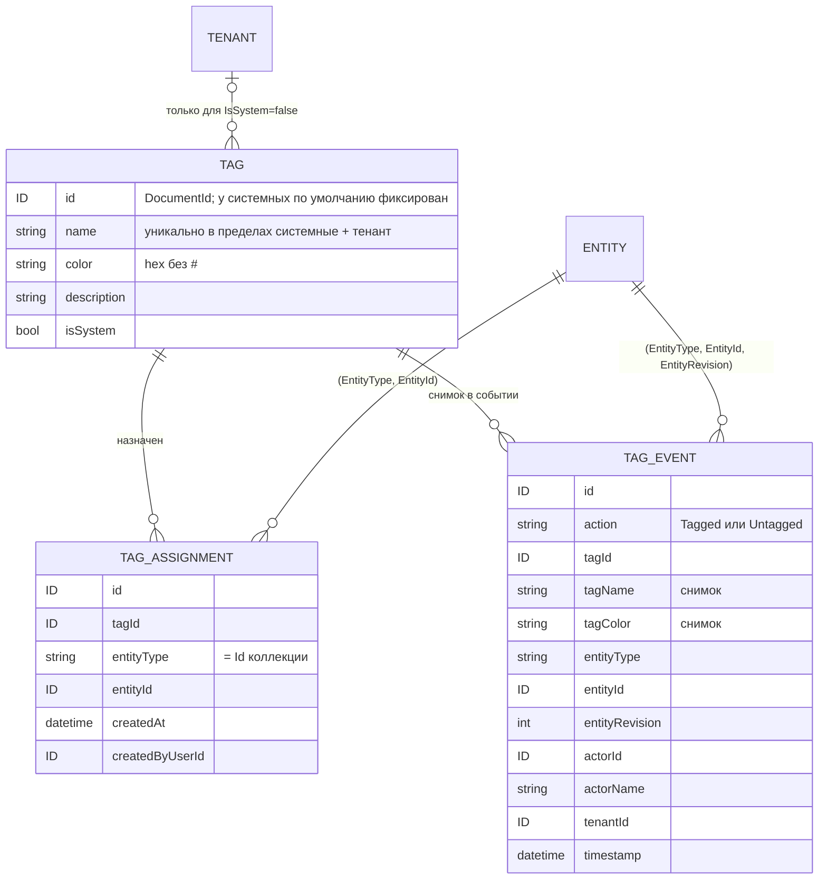
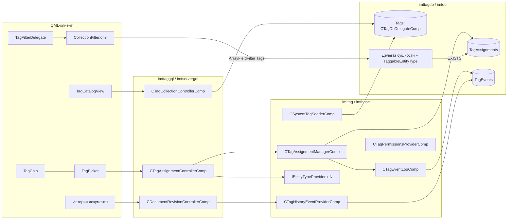

# Архитектура подсистемы Tags (аналог GitHub Labels)

Статус: ревизия 3, этап 1 реализован в ветке `feature/tags`. Дата: 2026-09-25.

## Этап 1: что сделано

Реализовано всё, кроме событий Tagged/Untagged и их показа в истории документа (D5 отложено):

- `imttag` / `imttagdb` — модель, каталог (документная коллекция), таблица `TagAssignments`, менеджер назначений, засев системных тегов;
- `imtdb` — поле `Tags` в фильтре коллекций (`CTagFilterSqlBuilder`, атрибут делегата `TaggableEntityType`), тест `imtdbTest` на SQLite;
- `Sdl/imttag` + `imttaggql` — GraphQL-API каталога и назначений, права;
- `Qml/imttaggui` — чипы, страница каталога, редактор тега, поле тегов сущности, фильтр (§12);
- `Partitura/ImtTagVoce.arp` — всё серверное в одном компоненте `TagController` (§13).

Разделы §5, §6.1, §7, §8 и §10 ниже ещё описывают `TagEvents` и историю — это цель следующего этапа, в коде их нет.

## 0. Решения владельца

| # | Вопрос | Решение | Следствие для архитектуры |
|---|---|---|---|
| D1 | Размещение | Новые библиотеки | `imttag` / `imttagdb` / `imttaggql` + `Sdl/imttag` + `Qml/imttaggui` |
| D2 | Scope и уникальность | Каталог тенанта плюс системные теги, которые видят все. Имя уникально в пределах «системные + тенант» | Явный флаг `IsSystem` у тега; своя проверка уникальности (§6.3) |
| D3 | Жизненный цикл | Теги существуют независимо от сущностей | Никакого каскада при удалении или восстановлении сущности; назначение не создаёт тег; тег без назначений — нормальное состояние |
| D4 | Архивация | Не делаем | Вне объёма v1 |
| D5 | События Tagged / Untagged | Своя таблица, связанная с историей документа. **Отложено: не входит в этап 1** | Таблица `TagEvents` с номером ревизии сущности; события показываются в `GetRevisionInfoList` |
| D6 | Ограничение тега по типам сущностей | Не нужно | Любой тег ставится на любую сущность, для которой включены теги |
| D7 | Права | Теги тенанта — отдельные permissions; системные — только SU | Провайдер разрешений `IFeatureInfoProvider`; проверка `IsSuperuserRequest` |
| D8 | Теги по умолчанию | Да, системные | Засев системных тегов с фиксированными Id при старте |

---

## 1. Резюме

Tag — документ каталога (имя, цвет, описание, `IsSystem`). Он навешивается по Id на любую сущность ImtCore; адрес сущности — пара `(EntityType, EntityId)`, так что схема сущности не меняется.

Каталог клиента — это системные теги плюс теги его тенанта. Системными управляет только SU, тегами тенанта — владельцы отдельных разрешений. Системные теги по умолчанию (набор GitHub) засеиваются один раз и видны всем.

Назначения живут в своей таблице и не зависят от жизненного цикла сущности и тега. Мягкое удаление с последующим восстановлением сохраняет назначения. Каждое назначение и снятие пишется в `TagEvents` вместе с номером ревизии сущности и показывается в истории документа.

Фильтр `label:` / `,` / `-label:` / `no:label` передаётся уже существующим `ArrayFieldFilter` и превращается в переносимые `EXISTS`-подзапросы, которые работают и в Postgres, и в SQLite.

Изменения в существующем коде точечные и аддитивные:
- атрибут `TaggableEntityType` у SQL-делегата документов;
- точка расширения истории в `CDocumentRevisionControllerComp` и поле `kind` у `RevisionItem`;
- сборка `ArrayFieldFilter` в `CollectionFilter.qml`;
- перенос `imtdesk::ILabel` и `IEntityTypeProvider` в новые библиотеки и в `imtbase`.

---

## 2. Модель GitHub Labels (сверено с документацией)

| Аспект | Факт | Источник |
|---|---|---|
| Scope | Метки принадлежат репозиторию; изменения в одном не влияют на другие | [Managing labels](https://docs.github.com/en/issues/using-labels-and-milestones-to-track-work/managing-labels) |
| Поля | `id`, `node_id`, `url`, `name`, `color` (hex), `default`; необязательные — `description`, `archived_at`, `archived_by` | [REST: Labels](https://docs.github.com/en/rest/issues/labels) |
| По умолчанию | 10 меток в новом репозитории (accessibility, bug, documentation, duplicate, enhancement, good first issue, help wanted, invalid, question, wontfix); владелец организации может задать свой набор | Managing labels |
| Куда ставятся | Issues, pull requests, discussions | Managing labels |
| Операции над объектом | `GET` список; `POST` добавить; `PUT` заменить набор; `DELETE` снять все; `DELETE …/{name}` снять одну. `POST` **не создаёт** отсутствующие метки | REST: Labels |
| Каталог | `POST/GET/PATCH/DELETE /repos/{o}/{r}/labels[/{name}]` | REST: Labels |
| Удаление | «Deleting a label will remove the label from issues and pull requests» | Managing labels |
| Переименование | Прямо не описано; ссылки по `id`, в `label.edited` приходит `changes.name.from` | [Webhooks](https://docs.github.com/en/webhooks/webhook-events-and-payloads) |
| Поиск | `label:X` (несколько — И), `label:a,b` (ИЛИ), `-label:X` (НЕ), `no:label`; без учёта регистра | [Search](https://docs.github.com/en/search-github/searching-on-github/searching-issues-and-pull-requests) |
| История | `labeled` / `unlabeled`: `actor`, `created_at`, **снимок** `label{name,color}` | [Issue event types](https://docs.github.com/en/rest/using-the-rest-api/issue-event-types) |
| Webhooks | `label`: created / edited / deleted / archived / unarchived; `issues` и `pull_request`: labeled / unlabeled | Webhooks |
| Права | Triage+ ставит и снимает метки; Write+ создаёт, редактирует и удаляет | [Repository roles](https://docs.github.com/en/organizations/managing-user-access-to-your-organizations-repositories/managing-repository-roles/repository-roles-for-an-organization) |

**Где мы сознательно отходим от GitHub:**
- **Удаление тега.** У нас оно мягкое: назначения сохраняются, но скрыты, и при восстановлении тега возвращаются (D3). В GitHub удаление снимает метку со всех объектов.
- **Архивация** не делается (D4).
- **Системные теги** — общий для всех тенантов каталог, а не копия набора по умолчанию в каждом репозитории (D8).

---

## 3. Соответствие GitHub → ImtCore

| Понятие | GitHub | ImtCore |
|---|---|---|
| Область каталога | Repository | Tenant (`TenantEntityBindings`) |
| Метки организации по умолчанию | Org default labels | Системные теги (`IsSystem=true`), общие для всех тенантов, засеиваются при старте |
| Метка | Label | `imttag::ITag` (бывший `imtdesk::ILabel`) + `IsSystem` |
| Объект с метками | Issue / PR / Discussion | Любой объект коллекции с включёнными тегами: `(EntityType, EntityId)` |
| Связь | issue ↔ labels | Таблица `TagAssignments` |
| Add / Remove | POST / DELETE | `EntityTagsAdd` / `EntityTagRemove` (оба — для нескольких сущностей сразу) |
| `label:a label:b` | И | `ArrayFieldFilter{fieldId:"Tags", ArrayHasAll}` |
| `label:a,b` | ИЛИ | `ArrayHasAny` |
| `-label:a` | НЕ | `ArrayHasAny` + `Not` |
| `no:label` | нет меток | `ArrayIsEmpty` |
| Timeline labeled / unlabeled | Issue events | `TagEvents` → строки `kind=TagEvent` в `GetRevisionInfoList` |
| Webhook `label.*` | label event | Нет (подписки убраны в этапе 1: ими никто не пользовался) |
| Webhook `issues.labeled` | issues event | Нет; изменение видно как `CF_ASSIGNMENTS_CHANGED` у `ITagAssignmentManager` |
| Triage / Write | Роли репозитория | Разрешения `AssignTags` / `ManageTags` у организационных ролей |
| Org owner | Управляет набором по умолчанию | SU управляет системными тегами |

---

## 4. Аудит переиспользования

| Абстракция | Путь | Решение | Обоснование |
|---|---|---|---|
| `imtdesk::ILabel`, `CLabelComp` | `Include/imtdesk/ILabel.h`, `CLabelComp.h` | **Перенести** в `imttag::ITag` / `CTagComp` + поле `IsSystem` | Уже «like GitHub Labels» (Id / Name / hex Color / Description). В imtdesk на переходный период остаётся typedef |
| `LabelData` (SDL) | `Sdl/imtdesk/1.0/ImtDesk.sdl:51` | **Перенести** в `Sdl/imttag/1.0/Tags.sdl` как `TagData` | Та же форма; каталога и CRUD у меток в ImtDesk нет |
| `ISupportTicket::GetLabelIds/GetTags` | `Include/imtdesk/ISupportTicket.h:197`, `CSupportTicketComp.cpp:414-416` | **Мигрировать** (§13) | Два параллельных механизма внутри JSON тикета, без фильтрации в БД |
| `imtbase::IObjectCollection` / `ICollectionInfo` | `Include/imtbase/IObjectCollection.h`, `ICollectionInfo.h` | **Как есть** — каталог | CRUD, мягкое удаление и `RestoreObjects`, `MIT_REVISION`, `CF_ADDED/CF_REMOVED` |
| `IObjectCollection::InsertNewObject(proposedElementId)` | `Include/imtbase/IObjectCollection.h:121` | **Как есть** — засев | Фиксированный Id делает засев идемпотентным |
| `CSqlDatabaseDocumentDelegateComp` / `…CompBase` | `Include/imtdb/CSqlDatabaseDocumentDelegateCompBase.*` | **Как есть** для каталога; **наследник** `CTagDbDelegateComp`; **расширить** атрибутом `TaggableEntityType` | Ревизии, мягкое удаление (`State='Disabled'`, `.cpp:284`), тенантные привязки, `PrerequisiteTableScriptPath`, `CreateJsonExtractSql`, виртуальный `CreateTenantBindingFilterQuery` (`.cpp:1204`) |
| `TenantEntityBindings` и автоподстановка `TenantFilter` | `Include/imtservergql/CObjectCollectionControllerCompBase.cpp:2845-2853`, `Include/imtauthgql/imtauthgql.h:911` | **Как есть** | Тег тенанта автоматически привязывается к тенанту запроса, каталог автоматически фильтруется |
| `ITenantEntityBinding(Manager)`, `CTenantEntityBindingManagerComp`, `CTenantEntityBindingDbDelegateComp`, `CreateTenantEntityBindingsTable.sql` | `Include/imtauth/`, `Include/imtauthdb/` | **Шаблон** (клон структуры) для `TagAssignments` | Та же форма `(X, EntityType, EntityId, CreatedAt, CreatedByUserId)`; прямое использование отвергнуто — у `TenantId` другой смысл, и слой `imtauth` не подходит |
| Каскад `CreateTenantBindingDeleteQuery` при удалении | `CSqlDatabaseDocumentDelegateCompBase.cpp:294` | **Не повторять** | При мягком удалении стирает привязки; для тегов это нарушило бы D3 |
| `IComplexCollectionFilter::FO_ARRAY_*`, `ArrayFieldFilter`, `GroupFilter` | `Include/imtbase/IComplexCollectionFilter.h:76-83`, `Sdl/imtbase/1.0/ComplexCollectionFilter.sdl` | **Как есть** на уровне протокола | Семантика `label:` / `,` / `-` / `no:label` уже есть; разбор — `CComplexCollectionFilterRepresentationController.cpp:33-40` |
| `CComplexCollectionFilterConverter` | `Include/imtdb/CComplexCollectionFilterConverter.cpp:191` | **Обойти** для поля `Tags` | Массивы переводятся в JSONB — **только Postgres**; поле перехватывает делегат (§9) |
| `ICollectionFilter` текстовый фильтр | `Include/imtbase/ICollectionFilter.h`, `CreateTextFilterQuery` (`.cpp:1658`) | **Как есть** — проверка уникальности имени | `LIKE`/`ILIKE` отбирает кандидатов, точное регистронезависимое сравнение делается в C++ |
| `imtbase::IObjectMetaInfoUniquenessValidator` | `Include/imtbase/IObjectMetaInfoUniquenessValidator.h` | **Не подходит** | В сигнатуре нет тенантного контекста, а уникальность по D2 зависит от scope |
| `imtdesk::IEntityTypeProvider` | `Include/imtdesk/IEntityTypeProvider.h` | **Перенести** в `imtbase` (в imtdesk — typedef) | Реестр типов через `I_MULTIREF`; «Id типа = Id коллекции» — это наш `EntityType` |
| `imtbase::IObjectCollectionProvider` | `Include/imtbase/IObjectCollectionProvider.h` | **Как есть** | Коллекция по типу: проверка существования сущности и права на чтение |
| `imtbase::IRevisionController` + `CDocumentRevisionControllerComp` + `DocumentRevision.sdl` | `Include/imtbase/IRevisionController.h`, `Include/imtservergql/CDocumentRevisionControllerComp.cpp:98-200`, `Sdl/imtbase/1.0/DocumentRevision.sdl` | **Расширить** | История документа = список ревизий с описанием от `IDocumentChangeGenerator`. Добавляется `I_MULTIREF` на провайдеры событий и поле `RevisionItem.kind` (§10) |
| `ICollectionInfo::MIT_REVISION` | `Include/imtbase/ICollectionInfo.h:159` | **Как есть** | Номер текущей ревизии сущности в момент события |
| `CDocumentChangeGeneratorCompBase` | `Include/imtbase/CDocumentChangeGeneratorCompBase.h` | **Как есть** — история правок тега | Как у ролей (`CRoleChangeGeneratorComp`) |
| `imtlog::CEventHistoryControllerComp` | `Include/imtlog/` | **Отказ** (D5) | Нужна своя таблица, привязанная к ревизиям сущности |
| `imtdesk::IEntityReferenceStorage`, `imtbase::IReferenceCollection`, `IObjectMetaInfo` / `IDocumentMetaInfo` | — | **Не подходят** | Снимки-ссылки, ссылки внутри одной коллекции без автора и времени, или новая ревизия сущности на каждое назначение |
| `imtbase::IOperationContext` | `Include/imtbase/IOperationContext.h` | **Как есть** | Автор, тенант |
| `imtbase::ITransactionManager` | `Include/imtbase/ITransactionManager.h` | **Как есть** | Назначение и событие пишутся в одной транзакции |
| `imtlic::IFeatureInfoProvider` + `CFeatureInfo` (шаблон — `COrganizationsPermissionsProviderComp`) | `Include/imtauth/COrganizationsPermissionsProviderComp.cpp:40-340` | **Шаблон** для `CTagPermissionsProviderComp` | Разрешения организации объявляются деревом `FeatureInfo` с `SetIsPermission(true)` |
| `imtlicgql::CProductInfoProviderComp` (`PermissionsProvider`, multi) | `Include/imtlicgql/CProductInfoProviderComp.h:28` | **Как есть** | Подключение провайдера разрешений тегов к продукту |
| `CPermissibleGqlRequestHandlerComp` + `ICommandPermissionsProvider` + `IPermissionChecker` | `Include/imtservergql/CPermissibleGqlRequestHandlerComp.h:21` | **Как есть** | Проверка прав на команды |
| `IsSuperuserRequest` | `Include/imtauthgql/imtauthgql.h:932` | **Как есть** | Операции над системными тегами |
| `CSdlCollectionControllerCompBase`, `collectionSchema` | `Include/imtservergql/`, образец — `Sdl/imtauth/1.0/Roles.sdl` | **Как есть** | CRUD каталога |
| `CObjectCollectionChangeNotifierComp`, `CGqlPublisherCompBase` | `Include/imtservergql/CObjectCollectionChangeNotifierComp.h` | **Как есть** / **база** | Подписки |
| QML: `CollectionFilter.qml`, `FilterPanelDecorator.qml`, `FilterMenu.qml`, `FilterDelegateBase.qml`, `OptionsFilterDelegate.qml`, `CheckBoxMenu.qml`, `CheckableListPanel.qml`, `SearchTextInput.qml`, `Popup.qml`, `DocumentRevisionsDataProvider.qml` | `Qml/imtcolgui/`, `Qml/imtgui/Panels/`, `Qml/imtcontrols/`, `Qml/imtdocgui/` | **Как есть**; `CollectionFilter.qml` и представление ревизий — **расширить** | Нет сборки `ArrayFieldFilter`; строки событий нельзя «восстанавливать» |
| Чип тега | `Qml/imtdeskgui/TicketView.qml:221-243` | **Вынести** в `TagChip.qml` | Готовая разметка на Style-токенах |

---

## 5. Доменная модель



- **Системный тег**: `IsSystem=true`, тенант-привязки нет. Виден во всех тенантах и в режиме «без организации»; менять его может только SU.
- **Тег тенанта**: `IsSystem=false`, привязан к тенанту через стандартный `TenantEntityBindings`; привязка создаётся автоматически из контекста запроса. В режиме «без организации» (однотенантные установки) тег тенанта — это `IsSystem=false` без привязки, и флаг отличает его от системного.
- **Назначение** не хранит тенант: он выводится из тега и сущности. Инвариант при назначении: `tag.IsSystem || tenant(tag) == tenant(entity)`.
- **«Любая сущность»**: `EntityType` — Id коллекции, зарегистрированной в реестре `IEntityTypeProvider`, у SQL-делегата которой задан `TaggableEntityType`. Ограничений «тег ↔ тип» нет (D6).

---

## 6. Хранение и жизненный цикл

### 6.1 Таблицы

**`Tags`** — документная таблица наследника `CSqlDatabaseDocumentDelegateComp` (`CTagDbDelegateComp`): `DocumentId`, `Document` (JSON, включая `IsSystem`), `RevisionNumber`, `IsActive`, `State`. Ревизии и история правок получаются бесплатно.

**`TagAssignments`** (по образцу `CreateTenantEntityBindingsTable.sql`, Postgres и SQLite):

| Колонка | Тип | |
|---|---|---|
| `Id` | TEXT PK | UUID |
| `TagId` | TEXT NOT NULL | |
| `EntityType` | TEXT NOT NULL | |
| `EntityId` | TEXT NOT NULL | |
| `CreatedAt` | TIMESTAMP NOT NULL | UTC |
| `CreatedByUserId` | TEXT | |

- `UNIQUE (TagId, EntityType, EntityId)`, вставка идемпотентна (`ON CONFLICT DO NOTHING` / `INSERT OR IGNORE`).
- Индексы: `(EntityType, EntityId)`, `(TagId)`, `(EntityType, TagId)`.

**`TagEvents`** — только добавление, без обновлений и удалений:

| Колонка | Тип |
|---|---|
| `Id` | TEXT PK |
| `Action` | TEXT NOT NULL (`Tagged` / `Untagged`) |
| `TagId`, `TagName`, `TagColor` | TEXT (снимок на момент события) |
| `EntityType`, `EntityId` | TEXT NOT NULL |
| `EntityRevision` | INTEGER (из `MIT_REVISION`; NULL, если у коллекции нет ревизий) |
| `ActorId`, `ActorName` | TEXT |
| `TenantId` | TEXT |
| `Timestamp` | TIMESTAMP NOT NULL |

Индекс: `(EntityType, EntityId, Timestamp)`.

Внешних ключей нет: у документной таблицы `Tags` несколько строк на `DocumentId`, поэтому FK на неё невозможен. Целостность обеспечивается приложением внутри транзакций. Раз FK нет, гонки ленивого создания таблиц тоже нет. Если FK когда-либо появится, таблицы нужно подключать через `PrerequisiteTableScriptPath`.

### 6.2 Жизненный цикл (D3)

| Событие | Поведение |
|---|---|
| Назначение несуществующего или удалённого тега | Ошибка, как в GitHub (`POST` не создаёт метку) |
| Мягкое удаление сущности | Назначения **не трогаются**. Сущность и так отсекается фильтром `State='Active'` в своей коллекции |
| Восстановление сущности | Теги на месте, никаких действий не нужно |
| Мягкое удаление тега | Назначения **не трогаются**, тег пропадает из каталога, чипов и фильтра (join по активным тегам, §9). События по сущностям не пишутся — изменение видно в истории самого тега |
| Восстановление тега | Повторная проверка уникальности имени (§6.3); если имя занято — отказ. После восстановления назначения снова видны |
| Физическое удаление | В v1 не предусмотрено ни для тегов, ни для назначений; открытый вопрос на будущее (§15) |
| Удаление тенанта | Теги тенанта удаляются мягко вместе с остальными документами тенанта; назначения остаются, но недостижимы |

### 6.3 Уникальность имени (D2)

Имя сравнивается регистронезависимо, по обрезанным пробелам, только среди **активных** тегов.

| Операция | Множество для проверки |
|---|---|
| Создание, переименование или восстановление тега тенанта T | Системные ∪ теги T. Каталожный запрос с автоматическим `TenantFilter` уже возвращает ровно это множество (§9) |
| Создание, переименование или восстановление системного тега (SU) | **Все** активные теги всех тенантов (запрос без `TenantFilter`). При конфликте — отказ со списком тенантов, где имя занято |

Реализация — в `CTagCollectionControllerComp` без нового интерфейса: текстовый фильтр коллекции (`CreateTextFilterQuery`, `ILIKE`) отбирает кандидатов, точное сравнение делается в C++. Проверка и вставка выполняются в одной транзакции (`ITransactionManager`).

Остаточный риск — одновременное создание одноимённых тегов двумя пользователями одного тенанта. Он осознанно принят (§14). Если его нужно закрыть, добавляется узкая таблица `TagNames(ScopeKey, NormalizedName) UNIQUE`.

### 6.4 Засев системных тегов (D8)

`CSystemTagSeederComp` при создании компонента (`OnComponentCreated`, как в `COrganizationsPermissionsProviderComp`) вызывает `InsertNewObject` с **фиксированными** `proposedElementId` (`system.bug`, `system.documentation` и так далее, 10 штук из GitHub). Набор задаётся атрибутом в `.acc`.

Тег создаётся, только если строки с этим Id нет **ни в каком** состоянии. Поэтому системный тег, который SU удалил, не воскресает при следующем старте. Если имя конфликтует с существующим тегом тенанта, этот тег пропускается и пишется предупреждение в лог.

---

## 7. Интерфейсы и компоненты

| Библиотека | Элемент | Статус | Ответственность |
|---|---|---|---|
| `imttag` | `ITag` | перенесён (`imtdesk::ILabel`) + `IsSystem` | Модель |
| `imttag` | `CTagComp` | перенесён (`CLabelComp`) | Сериализация; новое поле — под `IVersionInfo` |
| `imttag` | `ITagAssignment` | новый (клон `ITenantEntityBinding`) | Строка назначения |
| `imttag` | `ITagAssignmentManager` | новый (по образцу `ITenantEntityBindingManager`) | `AddTags`, `SetTags`, `RemoveTag`, `ClearTags` (всё с `IOperationContext`); `GetTags(entityType, entityIds[])` пакетно, только активные теги; `GetUsageCount(tagIds[])` |
| `imttag` | `CTagAssignmentManagerComp` | новый | Назначение и событие пишутся в одной транзакции |
| `imttag` | `ITagEventLog` + `CTagEventLogComp` | новый | Запись событий и выборка по `(EntityType, EntityId)` |
| `imttag` | `CTagHistoryEventProviderComp` | новый, реализует `imtbase::IDocumentHistoryEventProvider` | Отдаёт события `TagEvents` в историю документа |
| `imttag` | `CSystemTagSeederComp` | новый | Засев (§6.4) |
| `imttag` | `CTagPermissionsProviderComp` | новый, `imtlic::IFeatureInfoProvider`, шаблон — `COrganizationsPermissionsProviderComp` | Дерево разрешений (§11) |
| `imtbase` | `IEntityTypeProvider` | перенесён из `imtdesk` | Реестр типов |
| `imtbase` | `IDocumentHistoryEventProvider` | **новый** | `GetHistoryEvents(collectionId, documentId, languageId)` → `{timestamp, user, description, revision}` |
| `imttagdb` | `CTagDbDelegateComp` | наследник `CSqlDatabaseDocumentDelegateComp` | Переопределяет `CreateTenantBindingFilterQuery` на `(<базовый>) OR IsSystem` и не создаёт тенант-привязку для системных тегов |
| `imttagdb` | `CTagAssignmentDbDelegateComp`, `CTagEventDbDelegateComp` | новые (клоны `CTenantEntityBindingDbDelegateComp`) | SQL |
| `imttagdb` | `Resources/SQL/{Postgres,SQLite}/Create{Tags,TagAssignments,TagEvents}Table.sql` | новые | Скрипты |
| `imtdb` | `CSqlDatabaseDocumentDelegateCompBase` | **расширен** атрибутами `TaggableEntityType`, `TagAssignmentsTableName`, `TagsTableName` | Перехват поля `Tags` в фильтре (§9); каскада нет |
| `imtservergql` | `CDocumentRevisionControllerComp` | **расширен** `I_MULTIREF(IDocumentHistoryEventProvider)` | Слияние ревизий и событий по времени до пейджинга и фильтра |
| `Sdl/imtbase/1.0/DocumentRevision.sdl` | `RevisionItem.kind: String` | **расширен** (аддитивно) | `Revision` (по умолчанию) или `TagEvent`; `revision` у события — ревизия сущности на момент события |
| `imttaggql` | `CTagCollectionControllerComp` | на базе `CSdlCollectionControllerCompBase` | CRUD каталога, уникальность, правила «системный → только SU» |
| `imttaggql` | `CTagAssignmentControllerComp` | на базе `CPermissibleGqlRequestHandlerComp` | get / add / remove; проверки типа, тенанта и чтения сущности |
| `imttaggql` | `CTagChangeGeneratorComp` | на базе `CDocumentChangeGeneratorCompBase` | История правок тега |



**Разводка `.acc`.** Каждый новый элемент добавляется ещё и в `ExportedComponents`, после чего нужен `cmake .`; иначе будет ошибка «Subcomponent X not found!». Атрибуты с `VersionInfo` пробрасываются вручную по всем уровням `.acc`.
- Реестр `TagRepository` по образцу `Partitura/ImtUserAdministrationVoce.arp/TenantEntityBindingSqlRepository.acc`. Состав: три коллекции, менеджер, журнал событий, засев.
- Продукт подключает: свои `IEntityTypeProvider` и `IObjectCollectionProvider` в `CTagAssignmentControllerComp`; `CTagHistoryEventProviderComp` в `CDocumentRevisionControllerComp`; `CTagPermissionsProviderComp` в `PermissionsProvider` у `CProductInfoProviderComp`.

**Последовательность «назначить тег»:**

```mermaid
sequenceDiagram
  participant UI as TagPicker
  participant C as CTagAssignmentControllerComp
  participant R as Реестр + коллекция сущности
  participant M as CTagAssignmentManagerComp
  participant DB as TagAssignments / TagEvents
  UI->>C: EntityTagsAdd(entityType, entityIds, tagIds)
  C->>C: CommandPermissions: AssignTags
  C->>R: тип зарегистрирован? сущности существуют и читаемы?
  C->>C: теги активны и (IsSystem или tenant(tag) = tenant(entity))
  C->>M: AddTags(..., IOperationContext)
  M->>DB: BEGIN; INSERT OR IGNORE назначений
  M->>R: MIT_REVISION сущностей
  M->>DB: INSERT TagEvents(Tagged, снимок name/color, revision) только для новых; COMMIT
  M-->>C: фактически добавленные
  C-->>UI: AddedNotificationPayload
```

---

## 8. API (SDL / GQL), один к одному с GitHub REST

Файл `Sdl/imttag/1.0/Tags.sdl`, импортирует `ImtCollection.sdl`. В SDL только то, чем пользуется клиент; `TagsList`, `TagItem`, `TagsUsage`, `EntityTagsSet`, `EntityTagsClear` и подписки убраны на этапе 1.

**Типы:**
- `TagData {id, name, color, description, isSystem}`;
- `EntityTags {entityId, tags: [TagData]}`;
- `EntityTagsChangedPayload {entityType, changes: [{entityId, addedTagIds, removedTagIds}]}`.

| GitHub | ImtCore GQL | Права |
|---|---|---|
| `GET /labels` | `GetSelectableItems(collectionId: "Tags", viewParams)` (`FilterableSelect.sdl`) — системные + тенант, текстовый поиск, пейджинг; у элемента `color`, в `params` — `IsSystem` и `UsageCount` | `ViewTags` |
| `POST /labels` | `TagAdd(TagData)`; `isSystem=true` → только SU; без текущей организации тег всегда системный | `ManageTags` / SU |
| `PATCH /labels/{name}` | `TagUpdate(TagData)`; для системного тега — только SU | `ManageTags` / SU |
| `DELETE /labels/{name}` | `RemoveElements` (`ImtCollection.sdl`), мягко; назначения тега удаляются в той же транзакции (`CTagDbDelegateComp`); `RestoreObjects` возвращает тег без назначений | `ManageTags` / SU |
| `GET /issues/{n}/labels` | `EntityTagsGet(entityType, entityIds[])` | `ViewTags` + чтение сущности |
| `POST /issues/{n}/labels` | `EntityTagsAdd(entityType, entityIds[], tagIds[])` | `AssignTags` |
| `DELETE /issues/{n}/labels/{name}` | `EntityTagRemove(entityType, entityIds[], tagIds[])` | `AssignTags` |
| `search: label:` | `ArrayFieldFilter{fieldId:"Tags"}` в `viewParams` любой коллекции с включёнными тегами | — |

Системные теги назначаются с обычным правом `AssignTags`: они и есть «теги по умолчанию».

---

## 9. Фильтрация

**Каталог.** `CTagDbDelegateComp` переопределяет `CreateTenantBindingFilterQuery`:

| Контекст | Базовое условие | Итог |
|---|---|---|
| Тенант T | `EXISTS binding(T)` | `EXISTS binding(T) OR IsSystem` |
| Без организации | `NOT EXISTS непустая binding` | Без изменений: системные теги сюда уже попадают |
| SU без `TenantFilter` (проверка уникальности системного) | нет | все теги |

`IsSystem` извлекается из JSON документа существующим `CreateJsonExtractSql`, который учитывает диалект.

**Сущности.** Клиент кладёт в `ComplexCollectionFilter.fieldsFilter` `ArrayFieldFilter` с `fieldId = "Tags"` и Id тегов. Делегат с `TaggableEntityType` перехватывает поле **до** `CComplexCollectionFilterConverter`:

| Операция | SQL (схематично) |
|---|---|
| `ArrayHasAny [a,b]` | `EXISTS (SELECT 1 FROM TagAssignments ta WHERE ta.EntityType='T' AND ta.EntityId=root.DocumentId AND ta.TagId IN (a,b))` |
| `ArrayHasAll [a,b]` | `(SELECT COUNT(DISTINCT ta.TagId) … IN (a,b)) = 2` |
| `ArrayHasAny + Not [a]` | `NOT EXISTS (… IN (a))` |
| `ArrayIsEmpty` | `NOT EXISTS (… JOIN Tags t ON t.DocumentId=ta.TagId AND t.IsActive AND t.State='Active')` |

- Для `HasAny` / `HasAll` / `Not` join с `Tags` не нужен: клиент передаёт Id активных тегов из каталога.
- `IsEmpty` и `EntityTagsGet` соединяются с активными тегами, поэтому назначения удалённых тегов не видны (§6.2).
- Комбинации строятся через существующий `GroupFilter` (`And` / `Or`).
- `EXISTS` и `COUNT` одинаково работают в SQLite и Postgres.
- Без атрибута `TaggableEntityType` поле `Tags` уходит в конвертер как раньше.

---

## 10. События и история документа (D5, отложено)

В этапе 1 не реализовано. Изменения назначений доступны только как уведомление `CF_ASSIGNMENTS_CHANGED` у `ITagAssignmentManager`.

- **Запись.** `CTagAssignmentManagerComp` пишет `TagEvents` в той же транзакции, что и назначения. Событие создаётся только при фактическом изменении: повторный `Add` ничего не пишет, а `Set` порождает разницу из `Tagged` и `Untagged`. `EntityRevision` берётся из `ICollectionInfo::MIT_REVISION` сущности, `Actor` — из `IOperationContext`.
- **Связь с историей документа.**
  - `CDocumentRevisionControllerComp::OnGetRevisionInfoList` (`.cpp:98`) получает `I_MULTIREF(imtbase::IDocumentHistoryEventProvider)`.
  - Для запрошенных `(collectionId, documentId)` строки ревизий сливаются с событиями провайдеров по времени **до** фильтра и пейджинга. Порядок в существующем коде это позволяет: `totalCount` и `activeRevision` считаются по всему списку.
  - Строка события: `kind=TagEvent`, `revision` = `EntityRevision`, `user` = `ActorName`, `description` = локализованное «Добавлен тег "bug"» или «Снят тег "bug"» по снимку имени, `isActive=false`.
- **Совместимость.** `kind` — новое необязательное поле; без подключённого провайдера ответ не меняется. QML истории (`Qml/imtdocgui/DocumentRevisionsDataProvider.qml` и её представление) скрывает «Restore / Export / Delete» у строк `kind != Revision`.
- **Правки каталога** — обычная история документа тега через `CTagChangeGeneratorComp`.
- **Уведомления** (когда понадобятся клиенту): каталог — `CObjectCollectionChangeNotifierComp`; назначения — публикатор поверх `CF_ASSIGNMENTS_CHANGED`.

---

## 11. Права (D7)

`CTagPermissionsProviderComp` (`imtlic::IFeatureInfoProvider`, по шаблону `COrganizationsPermissionsProviderComp`) объявляет дерево разрешений:

```
TagManagement
├── ViewTags        — видеть каталог, теги на объектах, фильтровать
├── AssignTags      — ставить и снимать теги (включая системные)
└── ManageTags      — управление тегами своего тенанта
    ├── AddTag
    ├── EditTag
    └── RemoveTag   — мягкое удаление и восстановление
```

- Разрешения назначаются организационным ролям тенанта и связываются с командами через `CommandPermissions` (`ICommandPermissionsProvider`).
- **Системные теги**: создание, правка, удаление и восстановление разрешены **только** при `IsSuperuserRequest(gqlRequest)`, независимо от ролей. `CTagCollectionControllerComp` проверяет это для любого тега с `IsSystem=true` и не даёт снять или поставить флаг `IsSystem` не-SU.
- **Изоляция**: тег тенанта T нельзя изменить или назначить из контекста другого тенанта. Назначение требует ещё и права читать сущность в её коллекции, иначе `EntityTagsGet` раскрывает существование чужих объектов.
- **Подключение**: провайдер добавляется в `PermissionsProvider` у `CProductInfoProviderComp` (`imtlicgql/CProductInfoProviderComp.h:28`, multi-ref). Надо проверить, должны ли эти разрешения попадать и в `OrganizationsProvider` у `CTenantMembershipManagerControllerComp` (`imtauthgql/CTenantMembershipManagerControllerComp.h:33`, одиночная ссылка) (§15).

---

## 12. UI: модуль `Qml/imttaggui`

Только контролы проекта и Style-токены; без Quick Controls, `Qt.binding` и `Qt.callLater`. Каждый список тегов — страница «Теги», пикер назначения и фильтр — строится на одном источнике: `TagSelectDataProvider` (`FilterableSelectGqlDataProvider` над коллекцией `"Tags"`: текстовый поиск, пейджинг, тенант-фильтр на сервере). Серверная сторона — `ImtTagGqlPck / TagSelectController` (наследник `FilterableSelectController`): у каждого элемента заполнен `color`, а в `params` лежат текстовые параметры `IsSystem` и `UsageCount`. Для этого в `CFilterableSelectControllerComp` добавлен виртуальный хук `OnSelectableItemCreated()`, поведение остальных пикеров не меняется.

| Компонент | Назначение |
|---|---|
| `TagChip`, `TagChipRow` | Тег как цветная «пилюля»: фон `"#" + color`, чёрный или белый текст по яркости фона, у системного тега — точка. `TagChipRow` переносит чипы по ширине |
| `TagSelectDataProvider` | Единый источник списков тегов; `isSystemTag()`, `getUsageCount()`, `getColor()` читают элемент |
| `TagSelectPopup` | `FilterableSelectPopup` с чекбоксами, где строка показывает цвет, имя и описание тега |
| `TagCatalogPanel` | Страница «Теги» в стиле панелей Support и History: `SimpleCollectionTable` + `SimpleCollectionItemDelegateBase` на `TagSelectDataProvider` (поиск, подгрузка); колонки «Tag», «Description», «Type», «Objects», меню строки Edit/Delete (панель — `actionHandler` строк), кнопки «Reload» и «New tag» (Alt+N) |
| `TagEditorDialog` | Создание и правка тега: имя, описание, цвет, превью. Флажок «System tag» показывается только SU и только при создании |
| `TagColorPalette` | 20 цветов палитры (стрелки влево/вправо), hex-поле с проверкой, кнопка «Random» |
| `EntityTagsCommand` | Обработчик команды `AssignTags` в коллекции (работает с выделением) и в редакторе (с сохранённым документом); включает и выключает команду; Alt+T открывает диалог |
| `EntityTagsDialog` | Диалог выбора тегов одной или нескольких сущностей; отмечены общие теги, по «Apply» (Ctrl+Enter) отправляется только разница (`EntityTagsAdd` / `EntityTagRemove`) |
| `EntityTagsProvider` | Пакетная загрузка тегов для Id видимой страницы коллекции — один запрос на страницу |
| `EntityTagsColumn` | Чипы тегов в строках коллекции после текста выбранной колонки (`setColumnContentById` таблицы) |
| `EntityTagsEditor` | Добавить или снять теги у одной или нескольких сущностей |
| `TagFilter`, `TagFilterDelegate` | Фильтр-чип панели фильтров коллекции: `SegmentedButton` «Any / All / Exclude» (Alt+1..3) и в той же строке флажок «No tags» (Alt+0); на чипе — имена выбранных тегов («bug, question», «bug + question», «not bug»), в списке — группа «Selected» |
| `CollectionFilter.createArrayFieldFilter()` | Общий построитель `ArrayFieldFilter` в `imtcolgui` |

### 12.1 Сценарии

**Создать тег.** Страница `TagCatalogPanel` → «New tag» → `TagEditorDialog` → `TagAdd`. Системные теги по умолчанию появляются сами при первом открытии каталога.

**Дать теги сущности — командой.** Одно решение для коллекции и редактора. На сервере в список команд вида добавляется готовая команда `ImtTagVoce / AssignTagsCommand` (Id `AssignTags`, иконка `Icons/Tag`, право `AssignTags`); на клиенте рядом с видом ставится обработчик:

```qml
// коллекция: команда работает с выделенными строками
EntityTagsCommand {
	view: collectionView
	entityType: "Devices"              // Id коллекции = TaggableEntityType
}

// редактор: команда доступна, когда документ сохранён
EntityTagsCommand {
	view: deviceEditor
	entityType: "Devices"
	entityIds: deviceEditor.isNewDocument ? [] : [deviceEditor.documentObjectId]
}
```

Команда открывает `EntityTagsDialog`: поиск по каталогу с цветами и чекбоксами. При нескольких объектах отмечены общие теги; отмеченное добавляется всем, снятое снимается у всех, остальное не трогается.

**Теги в строках коллекции** — как метки GitHub сразу после заголовка issue: цветные чипы идут за текстом первой колонки (или колонки `headerId`), больше `maxChips` сворачиваются в «+N». Теги видимой страницы приходят одним `EntityTagsGet` при каждой перезагрузке строк.

```qml
EntityTagsColumn {
	view: collectionView
	entityType: "Devices"
	active: PermissionsController.checkPermission("ViewTags")
}
```

**Фильтр.** Обычный фильтр-чип панели фильтров коллекции, рядом с остальными:

```qml
registerFieldFilterDelegate("Tags", tagFilterComp)

Component {
	id: tagFilterComp
	TagFilterDelegate {}
}
```

Чип открывает поиск по тегам с переключателем режима и кладёт в фильтр `ArrayFieldFilter{fieldId: "Tags"}`. Сервер переводит его в `EXISTS` по `TagAssignments` (§9).

**Клавиатура.** В `TagEditorDialog` фокус сразу в имени; Tab / Shift+Tab: имя → описание → палитра → hex → «Random» → флажок «System»; Enter в текстовом поле сохраняет, Esc отменяет. В списках тегов (`TagSelectPopup`, диалог, фильтр) работает навигация `FilterableSelectPopup`: стрелки, Space / Enter — отметить, Tab — между поиском и списком. Строки страницы «Теги», как и у Support / History, открываются мышью: у `SimpleCollectionTable` нет своей клавиатурной навигации.

**Инициализация ресурсов** в приложении: `ImtCoreInitTagQmlResources()` (клиент) и `ImtCoreInitTagSqlResources()` (сервер) из `imtcore/CImtCoreTagInitializer.h`. Для web-клиента каталоги модуля уже добавлены в `getImtCoreQmlWebDirs`.

---

## 13. Подключение продукта (`.acc`) и миграция ImtDesk

### 13.1 Сервер — один компонент

`Partitura/ImtTagVoce.arp/TagController.acc` (PostgreSQL) или `SQLiteTagController.acc` содержит всё: каталог и таблицу назначений, менеджер, засев системных тегов, GQL-контроллеры каталога, назначений и пикера, провайдер прав и соответствие «команда → право». Продукт делает пять вещей:

1. Добавляет элемент `ImtTagVoce / TagController` и задаёт экспортированные атрибуты: `DatabaseEngine`, `TaggableEntityTypes`; при желании `PermissionChecker`, `OperationContextController`, `UserActionManager`, `TranslationManager`, `VersionInfo`, `Log`, а также список системных тегов по умолчанию (`SystemTagIds`, `SystemTagNames`, `SystemTagColors`, `SystemTagDescriptions`).
2. Подключает экспортированные интерфейсы в свой сервер: `imtgql::IGqlRequestHandler` — в список обработчиков GQL, `imtlic::IFeatureInfoProvider` (`TagPermissionsProvider`) — в провайдеры прав продукта.
3. На каждый тип сущности с тегами — элемент `ImtTagPck / TaggableEntityType` (`EntityTypeId` = Id коллекции, `EntityTypeName`, `ObjectCollection`), который вносится в `TaggableEntityTypes`.
4. У SQL-делегата этой коллекции задаёт атрибут `TaggableEntityType` (тот же Id) — это включает фильтр по полю `Tags`.
5. Чтобы теги назначались командой, вносит элемент `ImtTagVoce / AssignTagsCommand` в списки команд коллекции и редактора (`CommandsController`), а на клиенте ставит `EntityTagsCommand` (§12.1).

Права `ViewTags`, `AssignTags` и `ManageTags` назначаются ролям организации; системными тегами управляет только SU.

### 13.2 ImtDesk (следующий шаг)

- `imtdesk::ILabel` → typedef на `imttag::ITag`, `LabelData` → `TagData`.
- Одноразовый перенос `labelIds` и строковых `tags` тикетов в каталог тенанта и в `TagAssignments`.
- `TicketView.qml` переходит на `TagChip`.

---

## 14. Совместимость и риски

- **Аддитивность.** Атрибуты делегата необязательны; `RevisionItem.kind` необязателен; `I_MULTIREF` в `CDocumentRevisionControllerComp` по умолчанию пуст. `ApplicationMain` и `ViewBase` не затрагиваются.
- **Сериализация.** `IsSystem` в `CTagComp` гейтится по `IVersionInfo`; в undo-архивах `IVersionInfo` нет, это нужно проверить для редактора тега.
- **Производительность.** Каждое условие по тегам — коррелированный подзапрос с индексом `(EntityType, EntityId)`. `HasAll` через `COUNT` при необходимости разворачивается в N `EXISTS`. Слияние истории грузит события документа целиком, как и сейчас ревизии.
- **Согласованность `EntityType`.** Одно и то же значение должно быть у реестра, у делегата и у `collectionId` клиента. При расхождении фильтр молча вернёт пустой результат, а история не покажет события; поэтому при старте нужна проверка реестра против делегатов.
- **Гонка уникальности** внутри тенанта (§6.3) принята; усиление — таблица `TagNames`.
- **Недостижимые назначения** (удалённые теги или удалённые тенанты) копятся без очистки, пока нет физического удаления.
- **Системный тег поверх занятого имени**: SU получает отказ со списком тенантов; автоматического слияния нет.

---

## 15. Открытые вопросы

1. **Организационные разрешения.** Должны ли `TagManagement` попадать в `OrganizationsProvider` у `CTenantMembershipManagerControllerComp` (одиночная ссылка) или достаточно `PermissionsProvider` продукта? От этого зависит, нужен ли joiner для `IFeatureInfoProvider`.
2. **Физическая очистка.** Нужна ли в будущем очистка навсегда удалённых тегов и назначений (retention)? В v1 её нет.
