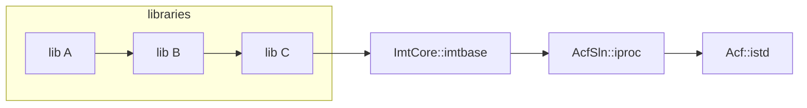

# Project Configuration — Target-Based Library Dependencies

> **Language:** English · [Русский](LibraryDependencies.ru.md)

This document explains the `*LibraryDependencies.cmake` files and the surrounding
"package" configuration that an ImtCore-based product uses to declare how its
libraries depend on each other and on the underlying `Acf::` / `AcfSln::` /
`IAcf::` / `ImtCore::` foundations.

Throughout this document a fictitious product **`Foo`** (library prefix `foo`) is
used for the examples; substitute your own product name and prefix.

It covers **what** the files are, **why** they exist, **how** they are wired into
the build, **how to create a new one** for a future end product, and a
**troubleshooting** section for the errors you will hit during a migration.

---

## Table of contents

1. [TL;DR](#1-tldr)
2. [The problem: legacy CMake](#2-the-problem-legacy-cmake)
3. [The solution: target usage requirements](#3-the-solution-target-usage-requirements)
4. [Key concepts](#4-key-concepts)
   - [4.1 Namespaced targets and `acf_register_library`](#41-namespaced-targets-and-acf_register_library)
   - [4.2 Link-scope variables (plain vs keyword signature)](#42-link-scope-variables-plain-vs-keyword-signature)
   - [4.3 Minimal direct dependencies](#43-minimal-direct-dependencies)
5. [Anatomy of a `<Project>LibraryDependencies.cmake`](#5-anatomy-of-a-projectlibrarydependenciescmake)
6. [How it is wired into the build](#6-how-it-is-wired-into-the-build)
7. [The full package file-set (the "new format")](#7-the-full-package-file-set-the-new-format)
8. [How to create a new one for a future product](#8-how-to-create-a-new-one-for-a-future-product)
9. [The unified in-tree build (super-build)](#9-the-unified-in-tree-build-super-build)
10. [Troubleshooting](#10-troubleshooting)
11. [Reference: existing files](#11-reference-existing-files)

---

## 1. TL;DR

A `<Project>LibraryDependencies.cmake` file is a **single, central place** that
declares the dependency graph between the static libraries of one product, as
**CMake target usage requirements** (`target_link_libraries`).

Instead of resolving symbols only at the final executable link and coordinating
the build order by hand, each library states *only its direct dependencies*, and
CMake propagates include directories and link order **transitively and
automatically** — both for the in-tree build and for downstream consumers that
`find_package(<Project>)` and link a single `<Project>::<lib>` target.

```cmake
# ImtCore example — imtauth needs imtdoc, imtlic, imtmail (its direct deps only)
imt_declare_library_dependencies(imtauth  imtdoc imtlic imtmail
    Qt${QT_VERSION_MAJOR}::Widgets Qt${QT_VERSION_MAJOR}::Gui Qt${QT_VERSION_MAJOR}::Svg)
```

Everything `imtauth` needs transitively (`imtbase`, `imtcrypt`, `imtrest`, …)
arrives automatically because those libraries declare *their* direct deps too.

---

## 2. The problem: legacy CMake

Historically the static libraries did **not** declare their dependencies on one
another. The consequences:

- **Symbols were resolved only at the final link.** Every executable/package had
  to list *every* library it transitively used, in the *right order*. These lists
  grew to 40–60 entries and were duplicated across dozens of `*Exe` / `*Pck`
  `CMakeLists.txt` files.
- **Build order was hand-tuned** with `add_dependencies(...)` calls to make sure
  generated headers (SDL, DDL) existed before a consumer compiled.
- **Include paths were global.** `include_directories()` exposed the whole source
  tree, so any library could accidentally `#include` any other — the real
  dependency graph was invisible and unenforced.
- **No `find_package` story.** Downstream products consumed the libraries through
  environment variables and manual `link_directories()`, not through imported
  targets.

## 3. The solution: target usage requirements

Modern CMake attaches **usage requirements** to each target:

- `target_include_directories(<lib> PUBLIC …)` — consumers inherit the header
  search paths transitively.
- `target_link_libraries(<lib> <scope> <dep>)` — consumers inherit the link and
  its include directories transitively, and CMake computes a correct link order
  (even for cyclic static libraries).

The `*LibraryDependencies.cmake` file is where the **inter-library edges** are
declared centrally, once, after all targets have been created.



A consumer that links `<Project>::A` transitively pulls `B`, `C`,
`ImtCore::imtbase`, `AcfSln::iproc`, `Acf::istd`, … with the correct include
paths and link order — without naming any of them.

---

## 4. Key concepts

### 4.1 Namespaced targets and `acf_register_library`

Every library's per-target `CMakeLists.txt` includes
`Config/CMake/StaticConfig.cmake`, which builds the static library and then calls
`acf_register_library(<lib>)` (defined in `Acf/Config/CMake/GeneralConfig.cmake`).
That function:

1. Adds the source tree (`INCLUDE_DIR`, `IMPL_DIR`) as **`PUBLIC`** include
   directories, wrapped in `$<BUILD_INTERFACE:…>` / `$<INSTALL_INTERFACE:include>`.
2. Creates the **namespaced alias** `${ACF_PACKAGE_NAME}::<lib>` (e.g.
   `ImtCore::imtbase`) so the *same spelling* works in-tree and for downstream
   `find_package` consumers.
3. Registers the target into the export set `${ACF_EXPORT_SET}`
   (default `"${ACF_PACKAGE_NAME}Targets"`) for `install(EXPORT …)`.

Because the include directories are `PUBLIC`, **a single** `ImtCore::` dependency
transitively provides the *entire* ImtCore/Acf/AcfSln/IAcf header search space to
the consuming library. This is why the dependency files can be minimal.

> **Naming convention:** a product's own (intra-project) dependencies use the
> **plain** target name (e.g. `foobase`, `foodata`); dependencies onto another
> package use the **namespaced** name (`ImtCore::imtbase`, `Acf::istd`, `AcfSln::iproc`).
> The `*Loc` localization libraries follow the same rule: `ImtCore::ImtCoreLoc`,
> `Acf::AcfLoc`, `AcfSln::AcfSlnLoc`.

### 4.2 Link-scope variables (plain vs keyword signature)

CMake's `target_link_libraries` has two mutually exclusive signatures:

```cmake
target_link_libraries(t a b c)              # plain   (legacy)
target_link_libraries(t PUBLIC a b c)       # keyword (PUBLIC/PRIVATE/INTERFACE)
```

> **CMake forbids mixing them on the same target.** All calls for one target must
> be *either* all-plain *or* all-keyword. Violating this is the #1 error during a
> migration (see [Troubleshooting](#10-troubleshooting)).

The whole ACF/ImtCore stack routes its link scope through four cache variables,
declared with `acf_define_link_scope_var(<VAR> <default> <doc>)` (a validated
cache `STRING`; only `''`, `PUBLIC`, `PRIVATE`, `INTERFACE` are accepted):

| Variable | Applies to | Typical value (migrated product) |
|---|---|---|
| `ACF_QT_MODULE_LINK_SCOPE` | Qt module links added by ACF helpers (`acf_use_qt_*`) | `PRIVATE` |
| `ACF_LIBRARY_LINK_SCOPE` | inter-library links (this file) | `PUBLIC` |
| `ACF_PACKAGE_LINK_SCOPE` | package (`*Pck`) libraries linking their deps | `PRIVATE` |
| `ACF_APPLICATION_LINK_SCOPE` | executables linking their deps | `PRIVATE` |

- When a scope is **empty (`""`)**, ACF's helper calls use the **plain** signature
  (this is the *legacy* mode; a not-yet-migrated product keeps all scopes empty so
  its inline plain `target_link_libraries` do not clash).
- When a scope is a **keyword**, the helper calls use the **keyword** signature
  (the *migrated* mode).

The helper in the dependency file honours `ACF_LIBRARY_LINK_SCOPE` (see below), so
the *same file* works in both modes.

### 4.3 Minimal direct dependencies

Each library lists **only its direct dependencies**. Transitive dependencies
propagate through the graph, so:

> **Do not add a dependency that is already reachable through another listed
> target.** For example, if a library lists `ImtCore::imtauth`, do not also list
> `ImtCore::imtbase` — `imtauth` already pulls `imtbase` transitively.

This keeps the graph readable and matches the `#include` reality of each library.

---

## 5. Anatomy of a `<Project>LibraryDependencies.cmake`

Take ImtCore's own [`ImtCoreLibraryDependencies.cmake`](../../Config/CMake/ImtCoreLibraryDependencies.cmake)
as the reference. A file has three parts (the examples below use the fictitious
product `Foo`).

### Part 1 — Header comment

A block explaining the approach and cross-referencing the sibling files
(`AcfLibraryDependencies.cmake`, `AcfSlnLibraryDependencies.cmake`, …). Keep it —
it is the first thing a new maintainer reads.

### Part 2 — The helper function

```cmake
function(foo_declare_library_dependencies target)
    cmake_parse_arguments(ARG "" "LINK_SCOPE" "" ${ARGN})

    # Default the per-entry scope to the product-wide library scope.
    if(NOT ARG_LINK_SCOPE)
        set(ARG_LINK_SCOPE ${ACF_LIBRARY_LINK_SCOPE})
    endif()

    # Skip feature-gated / not-configured targets silently.
    if(NOT TARGET ${target})
        return()
    endif()

    # Never target an ALIAS. In a unified in-tree build ImtCore::imtbasesdl is an
    # alias; target_link_libraries() is illegal on it, and augmenting the real
    # target would inject a dependency cycle through the Qt autogen targets.
    # The augmentation is only needed for the imported find_package() target.
    get_target_property(_foo_aliased ${target} ALIASED_TARGET)
    if(_foo_aliased)
        return()
    endif()

    foreach(dependency IN LISTS ARG_UNPARSED_ARGUMENTS)
        if(TARGET ${dependency})               # skip unavailable deps silently
            target_link_libraries(${target} ${ARG_LINK_SCOPE} ${dependency})
        endif()
    endforeach()
endfunction()
```

Four safety properties make the file safe to include in any configuration:

| Guard | Purpose |
|---|---|
| `if(NOT ARG_LINK_SCOPE)` → `ACF_LIBRARY_LINK_SCOPE` | works in both plain (`""`) and keyword mode |
| `if(NOT TARGET ${target})` `return()` | a feature-gated library that was not created is skipped |
| `ALIASED_TARGET` → `return()` | **never** call `target_link_libraries` on an alias (in-tree); prevents the illegal-alias error *and* the dependency cycle |
| `if(TARGET ${dependency})` | an `ImtCore::`/`Acf::` dep that is absent (legacy shim, not `find_package`) is skipped |

> ImtCore's own file uses a simpler variant that omits `LINK_SCOPE` parsing and
> uses `${ACF_LIBRARY_LINK_SCOPE}` directly. Use the `cmake_parse_arguments`
> variant shown above when you need per-entry `INTERFACE` scope for the SDL
> augmentation below.

### Part 3 — The dependency declarations

Grouped by category, with intra-project deps as plain names and cross-package deps
namespaced:

```cmake
# --- SDL generated libraries ------------------------------------------------
foo_declare_library_dependencies(foosdl      LINK_SCOPE PUBLIC  ImtCore::imtbasesdl)

# --- Universal libraries ----------------------------------------------------
foo_declare_library_dependencies(foobase     LINK_SCOPE PUBLIC  ImtCore::imtbase)
foo_declare_library_dependencies(foodata     LINK_SCOPE PUBLIC  foobase foogql
                                                                ImtCore::imtdev ImtCore::imtgeo)

# --- Arxc-generated static libraries ----------------------------------------
foo_declare_library_dependencies(FooLoc      LINK_SCOPE PUBLIC  Acf::icomp)
```

#### The `imtbasesdl → imtgql` augmentation (SDL products only)

Products whose SDL is GraphQL-oriented add one special line **before** the SDL
libraries:

```cmake
foo_declare_library_dependencies(ImtCore::imtbasesdl  LINK_SCOPE INTERFACE  ImtCore::imtgql)
```

This makes `ImtCore::imtbasesdl` expose `imtgql` as a usage requirement, so every
generated SDL library (which links `ImtCore::imtbasesdl`) transitively gets the
`imtgql` headers.

> **Critical:** this augmentation is meaningful **only** for the *imported*
> `find_package(ImtCore)` target. In a unified in-tree (super-build)
> `ImtCore::imtbasesdl` is an **alias** to the real in-tree `imtbasesdl`, and
> applying it there creates a fatal dependency cycle
> (`imtbasesdl → imtgql → … → imtserverapp → imtcolorsdl → imtbasesdl`) that also
> contains Qt autogen `UTILITY` targets. The `ALIASED_TARGET` guard in the helper
> makes the line a **no-op in-tree** (headers are already visible through global
> includes there) while keeping it active for `find_package` consumers.

---

## 6. How it is wired into the build

The file is `include()`d **once, centrally**, from the product's
`Build/CMake/CMakeLists.txt`, **after all library targets have been created**.
The surrounding setup (using the fictitious product `Foo`):

```cmake
# 1. Opt into the modern, target-based flow.
set(ACF_MODERN_CMAKE ON)

# 2. Name the package (drives the ImtCore::/Foo:: aliases and export set).
set(ACF_PACKAGE_NAME "Foo")

# 3. Pull in ImtCore (and transitively Acf/AcfSln/IAcf) as imported targets.
include(${FOO_DIR}/Config/CMake/FooEnv.cmake)

# 4. Choose the link scopes (keyword => migrated product).
acf_define_link_scope_var(ACF_QT_MODULE_LINK_SCOPE  "PRIVATE" "Qt module link scope")
acf_define_link_scope_var(ACF_LIBRARY_LINK_SCOPE    "PUBLIC"  "Inter-library link scope")
acf_define_link_scope_var(ACF_PACKAGE_LINK_SCOPE    "PRIVATE" "Package (Pck) link scope")
acf_define_link_scope_var(ACF_APPLICATION_LINK_SCOPE "PRIVATE" "Executable link scope")

# 5. Create every library / SDL / Loc target.
add_subdirectory(...)   # foobase, foodata, foosdl, FooLoc, ...

# 6. Declare the inter-library edges (THIS FILE), after the targets exist.
include("${FOO_DIR}/Config/CMake/FooLibraryDependencies.cmake")

# 7. Export the find_package(Foo) package.
include("${FOO_DIR}/Config/CMake/FooPackageExport.cmake")
```

`FooEnv.cmake` decides how ImtCore is consumed:

```cmake
if(NOT ACF_MODERN_CMAKE)
    # Legacy: global include/link dirs (no target-based deps).
elseif(NOT TARGET ImtCore::imtbase)
    # Discover the ImtCore build-tree package -> ImtCore:: imported targets.
    find_package(ImtCore REQUIRED GLOBAL)
endif()
```

In a **standalone** product build this runs `find_package(ImtCore)` and the
`ImtCore::` targets are *imported*. In a **unified in-tree** build the `ImtCore::`
targets already exist as *aliases*, so `find_package` is skipped — which is exactly
why the alias guard in the helper matters.

---

## 7. The full package file-set (the "new format")

A fully migrated product carries these files under `Config/CMake/`:

| File | Responsibility |
|---|---|
| `<Project>Env.cmake` | Resolve `IMTCOREDIR` etc.; in modern mode `find_package(ImtCore)` for the `ImtCore::`/`Acf::`/… imported targets. |
| **`<Project>LibraryDependencies.cmake`** | **The inter-library dependency graph (this document).** |
| `<Project>PackageExport.cmake` | `export()` + `install(EXPORT)` + `configure_package_config_file()` so downstream can `find_package(<Project>)`. |
| `<Project>Config.cmake.in` | Template for the generated `<Project>Config.cmake`; `find_dependency(ImtCore)` and includes the exported targets file. |

`<Project>PackageExport.cmake` produces two flavours of the package: a **build-tree**
one written next to the compiled libraries (`Lib/<config>/cmake`) and an
**install-tree** one for `cmake --install`. Both use `NAMESPACE <Project>::`.

---

## 8. How to create a new one for a future product

Assume a new product **`Foo`** with libraries `foobase`, `foodata`, `foogql`, a
`foosdl` SDL library, a `fooqml` web-resource library and a `FooLoc` Arxc library.

### Step 1 — Derive the dependency graph

For each library, find its **direct** dependencies. The authoritative sources are:

1. the existing inline `target_link_libraries(<lib> …)` in each per-library
   `CMakeLists.txt` (what it links today), and
2. the `add_dependencies(<lib> <sdl>)` calls in the `Build/CMake/CMakeLists.txt`
   (build-order hints that become real target deps), and
3. the `#include` graph of the library's headers/sources.

Then **classify** every dependency:

- **intra-`Foo`** → plain name (`foodata`).
- **ImtCore** → `ImtCore::<lib>` (e.g. `ImtCore::imtservice`).
- **AcfSln** → `AcfSln::<lib>` (e.g. `AcfSln::iproc`).
- **Acf** → `Acf::<lib>` (e.g. `Acf::istd`).
- **Qt** → `Qt${QT_VERSION_MAJOR}::<Module>`.

Finally **minimise**: drop any dependency already reachable through another listed
one (e.g. drop `ImtCore::imtbase` if `ImtCore::imtlic` is present, because
`imtlic → imtbase`).

### Step 2 — Copy the template

Create `Foo/Config/CMake/FooLibraryDependencies.cmake`:

```cmake
# ---------------------------------------------------------------------------
# Clean, target-based inter-library dependency graph for Foo.
# Mirrors ImtCore's own ImtCoreLibraryDependencies.cmake.
# Included once from Build/CMake/CMakeLists.txt after all targets are created.
# ---------------------------------------------------------------------------

function(foo_declare_library_dependencies target)
    cmake_parse_arguments(ARG "" "LINK_SCOPE" "" ${ARGN})

    if(NOT ARG_LINK_SCOPE)
        set(ARG_LINK_SCOPE ${ACF_LIBRARY_LINK_SCOPE})
    endif()

    if(NOT TARGET ${target})
        return()
    endif()

    # Never target an ALIAS (in-tree ImtCore:: aliases); prevents the illegal-alias
    # error and dependency cycles through the Qt autogen targets.
    get_target_property(_foo_aliased ${target} ALIASED_TARGET)
    if(_foo_aliased)
        return()
    endif()

    foreach(dependency IN LISTS ARG_UNPARSED_ARGUMENTS)
        if(TARGET ${dependency})
            target_link_libraries(${target} ${ARG_LINK_SCOPE} ${dependency})
        endif()
    endforeach()
endfunction()

# Only if Foo's SDL is GraphQL-oriented:
foo_declare_library_dependencies(ImtCore::imtbasesdl  LINK_SCOPE INTERFACE  ImtCore::imtgql)

# --- SDL generated libraries ------------------------------------------------
foo_declare_library_dependencies(foosdl   LINK_SCOPE PUBLIC  ImtCore::imtbasesdl)

# --- Libraries --------------------------------------------------------------
foo_declare_library_dependencies(foobase  LINK_SCOPE PUBLIC  ImtCore::imtservice)
foo_declare_library_dependencies(foodata  LINK_SCOPE PUBLIC  foosdl foobase)
foo_declare_library_dependencies(foogql   LINK_SCOPE PUBLIC  foodata Qt${QT_VERSION_MAJOR}::WebSockets)

# --- QML web-resource libraries ---------------------------------------------
if(QT_VERSION_MAJOR EQUAL 6)
    foo_declare_library_dependencies(fooqml  LINK_SCOPE PUBLIC  Qt${QT_VERSION_MAJOR}::Core5Compat)
endif()

# --- Arxc-generated static libraries ----------------------------------------
foo_declare_library_dependencies(FooLoc   LINK_SCOPE PUBLIC  Acf::icomp)
```

### Step 3 — Wire it into the build

In `Foo/Build/CMake/CMakeLists.txt`, after all `add_subdirectory(...)` calls that
create the targets:

```cmake
include("${FOO_DIR}/Config/CMake/FooLibraryDependencies.cmake")
```

### Step 4 — Choose the mode

- **Fully migrated product** (recommended target state): set `ACF_MODERN_CMAKE ON`,
  `find_package(ImtCore)` via `FooEnv.cmake`, set the four scopes to keyword values
  with `acf_define_link_scope_var`, **remove** the inline `target_link_libraries`
  from the per-library files (they are now centralised), and keep the `*Exe`/`*Pck`
  inline links but switch them to `${ACF_APPLICATION_LINK_SCOPE}` /
  `${ACF_PACKAGE_LINK_SCOPE}`.
- **Legacy product not yet migrated:** keep the inline deps and force all four
  scopes to `""` in the product's `Build/CMake/CMakeLists.txt` so plain and keyword
  signatures never mix (see §9). The `FooLibraryDependencies.cmake` file can stay
  **unwired** until you complete the migration — it is inert until `include()`d.

### Step 5 (optional) — Publish a package

Add `FooPackageExport.cmake` + `FooConfig.cmake.in` (copy ImtCore's package-export
files as the template) so other products can `find_package(Foo)`.

---

## 9. The unified in-tree build (super-build)

A **super-build** may configure ACF, AcfSln and several ImtCore-based products in
one CMake tree. Because ACF is configured first and sets the link-scope cache
variables to **keyword** values, those keyword scopes are visible to *every*
subproject.

This has two consequences for a product that lives in the same tree:

1. **Already-migrated products** use keyword scopes everywhere — fine.
2. **Not-yet-migrated products** still use **plain** inline
   `target_link_libraries`. Mixing them with ACF's now-keyword helper calls is
   illegal. The fix is a **local override** at the top of the product's
   `Build/CMake/CMakeLists.txt`:

   ```cmake
   # Keep this project on the plain signature until it is fully migrated.
   set(ACF_QT_MODULE_LINK_SCOPE "")
   set(ACF_LIBRARY_LINK_SCOPE "")
   set(ACF_PACKAGE_LINK_SCOPE "")
   set(ACF_APPLICATION_LINK_SCOPE "")
   ```

   A **normal** variable shadows the cache variable for that directory subtree, so
   ACF's helpers emit the *plain* signature there, matching the product's inline
   plain calls. Each target stays internally consistent; cross-target linking does
   not care about signatures.

> The shared ACF helpers `AcfQt.cmake`, `AcfStd.cmake`, `AcfStdGui.cmake` were also
> updated to honour `${ACF_LIBRARY_LINK_SCOPE}` (they were previously hard-coded to
> the plain signature), so they follow whichever mode the consuming product selects.

### Migration checklist (per product)

- [ ] `set(ACF_MODERN_CMAKE ON)` and `set(ACF_PACKAGE_NAME "<Project>")`.
- [ ] `find_package(ImtCore)` through `<Project>Env.cmake`.
- [ ] `acf_define_link_scope_var(...)` with keyword values (remove the `""` override).
- [ ] Remove inline `target_link_libraries` from **library** `CMakeLists.txt`.
- [ ] Switch `*Exe`/`*Pck`/plugin inline links to the keyword scope variables.
- [ ] `include(<Project>LibraryDependencies.cmake)` after the targets.
- [ ] (optional) `include(<Project>PackageExport.cmake)`.

---

## 10. Troubleshooting

### "All uses of `target_link_libraries` with a target must be either all-keyword or all-plain"

**Cause:** the same target is linked with the plain signature in one place and the
keyword signature in another — typically an inline plain
`target_link_libraries(<lib> …)` in a not-yet-migrated product while a unified build
set the ACF scopes to keyword.

**Fix:** make the target consistent. Either force the product to plain mode (the
`""` scope override of §9) or migrate it to keyword and switch all its inline links
to the scope variables.

### "`target_link_libraries` can not be used on an ALIAS target"

**Cause:** a declaration whose *target* is a namespaced alias (e.g.
`ImtCore::imtbasesdl` in a unified in-tree build) — usually the SDL augmentation
line.

**Fix:** the `ALIASED_TARGET` guard in the helper (`return()` on aliases). Do **not**
resolve the alias and apply the link to the real target — see the next item.

### "The inter-target dependency graph contains a strongly connected component (cycle) … At least one of these targets is not a STATIC_LIBRARY"

**Cause:** the `imtbasesdl → imtgql` augmentation was applied to the **real in-tree**
`imtbasesdl` (e.g. by resolving the alias). This routes every SDL library back
through `imtgql → … → imtserverapp → imtcolorsdl → imtbasesdl`, and the Qt autogen
`UTILITY` targets (`*_autogen`, `*_autogen_timestamp_deps`) sit inside that loop.
Cyclic dependencies are allowed only among static libraries, so a `UTILITY` in the
cycle is fatal.

**Fix:** **skip** the augmentation on aliases (the `ALIASED_TARGET` → `return()`
guard). In-tree the SDL headers are already visible through global includes, so the
augmentation is unnecessary; it is only needed for the imported `find_package`
target, which is not an alias.

---

## 11. Reference: existing files

Foundation packages (relative to each repository root, `Config/CMake/`):

- `Acf/Config/CMake/AcfLibraryDependencies.cmake`
- `AcfSln/Config/CMake/AcfSlnLibraryDependencies.cmake`
- `IAcf/Config/CMake/IAcfLibraryDependencies.cmake`

ImtCore's own reference implementation for this repository:

- [`ImtCore/Config/CMake/ImtCoreLibraryDependencies.cmake`](../../Config/CMake/ImtCoreLibraryDependencies.cmake)

Supporting ACF machinery:

- `Acf/Config/CMake/GeneralConfig.cmake` — `acf_register_library`, `acf_use_qt_*`.
- `Acf/Config/CMake/ProjectRoot.cmake` — `acf_define_link_scope_var`.
- `Acf/Config/CMake/StaticConfig.cmake` — builds a static library and registers it.
