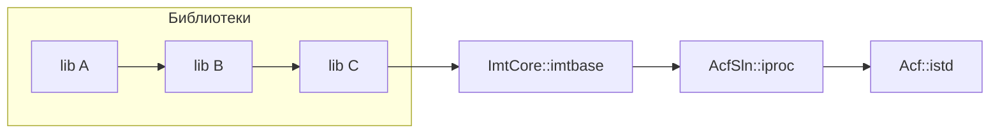

# Конфигурация проекта — целевые зависимости библиотек (target-based)

> **Язык:** Русский · [English](LibraryDependencies.en.md)

Этот документ описывает файлы `*LibraryDependencies.cmake` и связанную с ними
«пакетную» конфигурацию, которую использует продукт на базе ImtCore, чтобы
объявить, как его библиотеки зависят друг от друга и от нижележащих фундаментов
`Acf::` / `AcfSln::` / `IAcf::` / `ImtCore::`.

Во всех примерах используется вымышленный продукт **`Foo`** (префикс библиотек
`foo`); подставляйте имя и префикс своего продукта.

Здесь разобрано: **что** это за файлы, **зачем** они нужны, **как** они
подключаются к сборке, **как создать новый** для будущего конечного продукта, и
раздел **диагностики** ошибок, которые встречаются при миграции.

---

## Содержание

1. [Кратко](#1-кратко)
2. [Проблема: legacy-CMake](#2-проблема-legacy-cmake)
3. [Решение: usage requirements таргетов](#3-решение-usage-requirements-таргетов)
4. [Ключевые понятия](#4-ключевые-понятия)
   - [4.1 Именованные таргеты и `acf_register_library`](#41-именованные-таргеты-и-acf_register_library)
   - [4.2 Переменные link-scope (plain vs keyword)](#42-переменные-link-scope-plain-vs-keyword)
   - [4.3 Минимальные прямые зависимости](#43-минимальные-прямые-зависимости)
5. [Устройство файла `<Project>LibraryDependencies.cmake`](#5-устройство-файла-projectlibrarydependenciescmake)
6. [Как это подключается к сборке](#6-как-это-подключается-к-сборке)
7. [Полный набор файлов пакета («новый формат»)](#7-полный-набор-файлов-пакета-новый-формат)
8. [Как создать новый файл для будущего продукта](#8-как-создать-новый-файл-для-будущего-продукта)
9. [Единая in-tree сборка (super-build)](#9-единая-in-tree-сборка-super-build)
10. [Диагностика ошибок](#10-диагностика-ошибок)
11. [Справочник: существующие файлы](#11-справочник-существующие-файлы)

---

## 1. Кратко

Файл `<Project>LibraryDependencies.cmake` — это **единое центральное место**, где
граф зависимостей между статическими библиотеками одного продукта объявляется как
**usage requirements таргетов CMake** (`target_link_libraries`).

Вместо того чтобы разрешать символы только на финальной линковке исполняемого
файла и вручную выстраивать порядок сборки, каждая библиотека указывает *только
свои прямые зависимости*, а CMake **транзитивно и автоматически** протягивает пути
включения (include) и порядок линковки — как для in-tree сборки, так и для внешних
потребителей, которые делают `find_package(<Project>)` и линкуют один таргет
`<Project>::<lib>`.

```cmake
# Пример из ImtCore — imtauth нуждается в imtdoc, imtlic, imtmail (только прямые зависимости)
imt_declare_library_dependencies(imtauth  imtdoc imtlic imtmail
    Qt${QT_VERSION_MAJOR}::Widgets Qt${QT_VERSION_MAJOR}::Gui Qt${QT_VERSION_MAJOR}::Svg)
```

Всё, что нужно `imtauth` транзитивно (`imtbase`, `imtcrypt`, `imtrest`, …),
приходит автоматически, потому что эти библиотеки тоже объявляют *свои* прямые
зависимости.

---

## 2. Проблема: legacy-CMake

Исторически статические библиотеки **не** объявляли зависимости друг на друга.
Последствия:

- **Символы разрешались только на финальной линковке.** Каждый
  исполняемый файл/пакет должен был перечислить *все* транзитивно используемые
  библиотеки, в *правильном порядке*. Эти списки разрастались до 40–60 записей и
  дублировались в десятках `*Exe` / `*Pck` файлов `CMakeLists.txt`.
- **Порядок сборки настраивался вручную** через `add_dependencies(...)`, чтобы
  сгенерированные заголовки (SDL, DDL) существовали до компиляции потребителя.
- **Пути include были глобальными.** `include_directories()` открывал всё дерево
  исходников, поэтому любая библиотека могла случайно сделать `#include` любой
  другой — реальный граф зависимостей был невидим и не контролировался.
- **Не было `find_package`.** Внешние продукты подключали библиотеки через
  переменные окружения и ручные `link_directories()`, а не через импортированные
  таргеты.

## 3. Решение: usage requirements таргетов

Современный CMake прикрепляет **usage requirements** к каждому таргету:

- `target_include_directories(<lib> PUBLIC …)` — потребители транзитивно наследуют
  пути поиска заголовков.
- `target_link_libraries(<lib> <scope> <dep>)` — потребители транзитивно наследуют
  линковку и её include-пути, а CMake вычисляет корректный порядок линковки (даже
  для циклических статических библиотек).

Файл `*LibraryDependencies.cmake` — это место, где **рёбра между библиотеками**
объявляются централизованно, один раз, после создания всех таргетов.



Потребитель, линкующий `<Project>::A`, транзитивно подтягивает `B`, `C`,
`ImtCore::imtbase`, `AcfSln::iproc`, `Acf::istd`, … с правильными include-путями и
порядком линковки — не называя ни одну из них.

---

## 4. Ключевые понятия

### 4.1 Именованные таргеты и `acf_register_library`

`CMakeLists.txt` каждой библиотеки подключает `Config/CMake/StaticConfig.cmake`,
который собирает статическую библиотеку и затем вызывает
`acf_register_library(<lib>)` (определён в `Acf/Config/CMake/GeneralConfig.cmake`).
Эта функция:

1. Добавляет дерево исходников (`INCLUDE_DIR`, `IMPL_DIR`) как **`PUBLIC`**
   include-директории, обёрнутые в `$<BUILD_INTERFACE:…>` /
   `$<INSTALL_INTERFACE:include>`.
2. Создаёт **именованный алиас** `${ACF_PACKAGE_NAME}::<lib>` (например
   `ImtCore::imtbase`), чтобы *одно и то же написание* работало и in-tree, и для
   внешних потребителей `find_package`.
3. Регистрирует таргет в export-набор `${ACF_EXPORT_SET}`
   (по умолчанию `"${ACF_PACKAGE_NAME}Targets"`) для `install(EXPORT …)`.

Так как include-директории **`PUBLIC`**, **одна** зависимость `ImtCore::`
транзитивно предоставляет потребляющей библиотеке *всё* пространство заголовков
ImtCore/Acf/AcfSln/IAcf. Именно поэтому файлы зависимостей могут быть минимальными.

> **Соглашение об именах:** собственные (внутрипроектные) зависимости продукта
> используют **простое** имя таргета (например `foobase`, `foodata`); зависимости
> на другой пакет — **именованное** имя (`ImtCore::imtbase`, `Acf::istd`, `AcfSln::iproc`).
> Библиотеки локализации `*Loc` следуют тому же правилу: `ImtCore::ImtCoreLoc`,
> `Acf::AcfLoc`, `AcfSln::AcfSlnLoc`.

### 4.2 Переменные link-scope (plain vs keyword)

У `target_link_libraries` в CMake есть две взаимоисключающие сигнатуры:

```cmake
target_link_libraries(t a b c)              # plain   (legacy)
target_link_libraries(t PUBLIC a b c)       # keyword (PUBLIC/PRIVATE/INTERFACE)
```

> **CMake запрещает смешивать их на одном таргете.** Все вызовы для одного таргета
> должны быть *либо* полностью plain, *либо* полностью keyword. Нарушение этого —
> ошибка №1 при миграции (см. [Диагностику](#10-диагностика-ошибок)).

Весь стек ACF/ImtCore направляет свой link-scope через четыре кэш-переменные,
объявляемые через `acf_define_link_scope_var(<VAR> <default> <doc>)` (валидируемая
кэш-строка `STRING`; допустимы только `''`, `PUBLIC`, `PRIVATE`, `INTERFACE`):

| Переменная | Применяется к | Типовое значение (мигрированный продукт) |
|---|---|---|
| `ACF_QT_MODULE_LINK_SCOPE` | линковка Qt-модулей хелперами ACF (`acf_use_qt_*`) | `PRIVATE` |
| `ACF_LIBRARY_LINK_SCOPE` | межбиблиотечные связи (этот файл) | `PUBLIC` |
| `ACF_PACKAGE_LINK_SCOPE` | пакеты (`*Pck`), линкующие свои зависимости | `PRIVATE` |
| `ACF_APPLICATION_LINK_SCOPE` | исполняемые файлы, линкующие зависимости | `PRIVATE` |

- Когда scope **пуст (`""`)**, вызовы хелперов ACF используют **plain**-сигнатуру
  (это *legacy*-режим; ещё не мигрированный продукт держит все scope пустыми, чтобы
  его inline plain `target_link_libraries` не конфликтовали).
- Когда scope — **keyword**, вызовы хелперов используют **keyword**-сигнатуру
  (*мигрированный* режим).

Хелпер в файле зависимостей учитывает `ACF_LIBRARY_LINK_SCOPE` (см. ниже), поэтому
*один и тот же файл* работает в обоих режимах.

### 4.3 Минимальные прямые зависимости

Каждая библиотека перечисляет **только свои прямые зависимости**. Транзитивные
распространяются по графу, поэтому:

> **Не добавляйте зависимость, уже достижимую через другой перечисленный таргет.**
> Например, если библиотека указывает `ImtCore::imtauth`, не указывайте ещё и
> `ImtCore::imtbase` — `imtauth` уже подтягивает `imtbase` транзитивно.

Это сохраняет граф читаемым и соответствует реальному графу `#include` каждой
библиотеки.

---

## 5. Устройство файла `<Project>LibraryDependencies.cmake`

Возьмите за образец файл ImtCore
[`ImtCoreLibraryDependencies.cmake`](../../Config/CMake/ImtCoreLibraryDependencies.cmake).
Файл состоит из трёх частей (в примерах ниже используется вымышленный продукт `Foo`).

### Часть 1 — Заголовочный комментарий

Блок, объясняющий подход и ссылающийся на родственные файлы
(`AcfLibraryDependencies.cmake`, `AcfSlnLibraryDependencies.cmake`, …). Сохраняйте
его — это первое, что читает новый мейнтейнер.

### Часть 2 — Функция-хелпер

```cmake
function(foo_declare_library_dependencies target)
    cmake_parse_arguments(ARG "" "LINK_SCOPE" "" ${ARGN})

    # По умолчанию scope записи = общий библиотечный scope продукта.
    if(NOT ARG_LINK_SCOPE)
        set(ARG_LINK_SCOPE ${ACF_LIBRARY_LINK_SCOPE})
    endif()

    # Тихо пропускаем не созданные (feature-gated) таргеты.
    if(NOT TARGET ${target})
        return()
    endif()

    # Никогда не работаем с ALIAS. В единой in-tree сборке ImtCore::imtbasesdl —
    # это алиас; target_link_libraries() на нём недопустим, а аугментация реального
    # таргета внесла бы цикл зависимостей через autogen-таргеты Qt. Аугментация
    # нужна ТОЛЬКО для импортированного таргета find_package().
    get_target_property(_foo_aliased ${target} ALIASED_TARGET)
    if(_foo_aliased)
        return()
    endif()

    foreach(dependency IN LISTS ARG_UNPARSED_ARGUMENTS)
        if(TARGET ${dependency})               # тихо пропускаем недоступные зависимости
            target_link_libraries(${target} ${ARG_LINK_SCOPE} ${dependency})
        endif()
    endforeach()
endfunction()
```

Четыре защитных свойства делают файл безопасным для включения в любой конфигурации:

| Защита | Назначение |
|---|---|
| `if(NOT ARG_LINK_SCOPE)` → `ACF_LIBRARY_LINK_SCOPE` | работает и в plain (`""`), и в keyword-режиме |
| `if(NOT TARGET ${target})` `return()` | не созданная feature-gated библиотека пропускается |
| `ALIASED_TARGET` → `return()` | **никогда** не вызывать `target_link_libraries` на алиасе (in-tree); предотвращает ошибку алиаса *и* цикл зависимостей |
| `if(TARGET ${dependency})` | отсутствующая зависимость `ImtCore::`/`Acf::` (legacy-шим, не `find_package`) пропускается |

> Файл ImtCore использует упрощённый вариант без разбора `LINK_SCOPE`
> и с `${ACF_LIBRARY_LINK_SCOPE}` напрямую. Используйте показанный выше вариант с
> `cmake_parse_arguments`, когда нужен поэлементный scope `INTERFACE` для
> аугментации SDL ниже.

### Часть 3 — Объявления зависимостей

Сгруппированы по категориям; внутрипроектные — простыми именами, межпакетные —
именованными:

```cmake
# --- Сгенерированные SDL-библиотеки -----------------------------------------
foo_declare_library_dependencies(foosdl      LINK_SCOPE PUBLIC  ImtCore::imtbasesdl)

# --- Универсальные библиотеки -----------------------------------------------
foo_declare_library_dependencies(foobase     LINK_SCOPE PUBLIC  ImtCore::imtbase)
foo_declare_library_dependencies(foodata     LINK_SCOPE PUBLIC  foobase foogql
                                                                ImtCore::imtdev ImtCore::imtgeo)

# --- Статические библиотеки, сгенерированные Arxc ----------------------------
foo_declare_library_dependencies(FooLoc      LINK_SCOPE PUBLIC  Acf::icomp)
```

#### Аугментация `imtbasesdl → imtgql` (только для SDL-продуктов)

Продукты, чей SDL ориентирован на GraphQL, добавляют одну особую строку
**перед** SDL-библиотеками:

```cmake
foo_declare_library_dependencies(ImtCore::imtbasesdl  LINK_SCOPE INTERFACE  ImtCore::imtgql)
```

Это заставляет `ImtCore::imtbasesdl` предоставлять `imtgql` как usage requirement,
поэтому каждая сгенерированная SDL-библиотека (линкующая `ImtCore::imtbasesdl`)
транзитивно получает заголовки `imtgql`.

> **Критично:** эта аугментация имеет смысл **только** для *импортированного*
> таргета `find_package(ImtCore)`. В единой in-tree сборке (super-build)
> `ImtCore::imtbasesdl` — это **алиас** на реальный in-tree `imtbasesdl`, и её
> применение там создаёт фатальный цикл зависимостей
> (`imtbasesdl → imtgql → … → imtserverapp → imtcolorsdl → imtbasesdl`), в который
> к тому же попадают `UTILITY`-таргеты autogen Qt. Защита `ALIASED_TARGET` в
> хелпере делает строку **no-op в in-tree** (там заголовки уже видны через
> глобальные include), сохраняя её активной для потребителей `find_package`.

---

## 6. Как это подключается к сборке

Файл `include()`-ится **один раз, централизованно**, из `Build/CMake/CMakeLists.txt`
продукта, **после создания всех таргетов библиотек**. Окружающая настройка (на
примере вымышленного продукта `Foo`):

```cmake
# 1. Включаем современный target-based режим.
set(ACF_MODERN_CMAKE ON)

# 2. Имя пакета (задаёт алиасы ImtCore::/Foo:: и export-набор).
set(ACF_PACKAGE_NAME "Foo")

# 3. Подключаем ImtCore (и транзитивно Acf/AcfSln/IAcf) как импортированные таргеты.
include(${FOO_DIR}/Config/CMake/FooEnv.cmake)

# 4. Выбираем link-scope (keyword => мигрированный продукт).
acf_define_link_scope_var(ACF_QT_MODULE_LINK_SCOPE  "PRIVATE" "Qt module link scope")
acf_define_link_scope_var(ACF_LIBRARY_LINK_SCOPE    "PUBLIC"  "Inter-library link scope")
acf_define_link_scope_var(ACF_PACKAGE_LINK_SCOPE    "PRIVATE" "Package (Pck) link scope")
acf_define_link_scope_var(ACF_APPLICATION_LINK_SCOPE "PRIVATE" "Executable link scope")

# 5. Создаём все таргеты библиотек / SDL / Loc.
add_subdirectory(...)   # foobase, foodata, foosdl, FooLoc, ...

# 6. Объявляем межбиблиотечные рёбра (ЭТОТ ФАЙЛ), после создания таргетов.
include("${FOO_DIR}/Config/CMake/FooLibraryDependencies.cmake")

# 7. Экспортируем пакет find_package(Foo).
include("${FOO_DIR}/Config/CMake/FooPackageExport.cmake")
```

`FooEnv.cmake` решает, как потребляется ImtCore:

```cmake
if(NOT ACF_MODERN_CMAKE)
    # Legacy: глобальные include/link-директории (без target-based зависимостей).
elseif(NOT TARGET ImtCore::imtbase)
    # Находим build-tree пакет ImtCore -> импортированные таргеты ImtCore::.
    find_package(ImtCore REQUIRED GLOBAL)
endif()
```

В **отдельной** сборке продукта это вызывает `find_package(ImtCore)`, и таргеты
`ImtCore::` *импортированы*. В **единой in-tree** сборке таргеты `ImtCore::` уже
существуют как *алиасы*, поэтому `find_package` пропускается — именно поэтому важна
защита от алиаса в хелпере.

---

## 7. Полный набор файлов пакета («новый формат»)

Полностью мигрированный продукт несёт эти файлы в `Config/CMake/`:

| Файл | Ответственность |
|---|---|
| `<Project>Env.cmake` | Разрешает `IMTCOREDIR` и т.п.; в современном режиме `find_package(ImtCore)` для импортированных таргетов `ImtCore::`/`Acf::`/… |
| **`<Project>LibraryDependencies.cmake`** | **Граф межбиблиотечных зависимостей (этот документ).** |
| `<Project>PackageExport.cmake` | `export()` + `install(EXPORT)` + `configure_package_config_file()`, чтобы внешние могли `find_package(<Project>)`. |
| `<Project>Config.cmake.in` | Шаблон для генерируемого `<Project>Config.cmake`; `find_dependency(ImtCore)` и подключение файла экспортированных таргетов. |

`<Project>PackageExport.cmake` производит две разновидности пакета:
**build-tree** (записывается рядом со скомпилированными библиотеками,
`Lib/<config>/cmake`) и **install-tree** (для `cmake --install`). Обе используют
`NAMESPACE <Project>::`.

---

## 8. Как создать новый файл для будущего продукта

Предположим, новый продукт **`Foo`** с библиотеками `foobase`, `foodata`,
`foogql`, SDL-библиотекой `foosdl`, web-ресурсной библиотекой `fooqml` и
Arxc-библиотекой `FooLoc`.

### Шаг 1 — Выведите граф зависимостей

Для каждой библиотеки найдите её **прямые** зависимости. Авторитетные источники:

1. существующие inline `target_link_libraries(<lib> …)` в `CMakeLists.txt` каждой
   библиотеки (что она линкует сегодня), и
2. вызовы `add_dependencies(<lib> <sdl>)` в `Build/CMake/CMakeLists.txt` (подсказки
   порядка сборки, которые становятся реальными зависимостями таргетов), и
3. граф `#include` заголовков/исходников библиотеки.

Затем **классифицируйте** каждую зависимость:

- **внутри `Foo`** → простое имя (`foodata`).
- **ImtCore** → `ImtCore::<lib>` (например `ImtCore::imtservice`).
- **AcfSln** → `AcfSln::<lib>` (например `AcfSln::iproc`).
- **Acf** → `Acf::<lib>` (например `Acf::istd`).
- **Qt** → `Qt${QT_VERSION_MAJOR}::<Module>`.

Наконец **минимизируйте**: уберите любую зависимость, уже достижимую через другую
перечисленную (например, уберите `ImtCore::imtbase`, если присутствует
`ImtCore::imtlic`, потому что `imtlic → imtbase`).

### Шаг 2 — Скопируйте шаблон

Создайте `Foo/Config/CMake/FooLibraryDependencies.cmake`:

```cmake
# ---------------------------------------------------------------------------
# Чистый target-based граф межбиблиотечных зависимостей для Foo.
# Аналог собственного файла ImtCore ImtCoreLibraryDependencies.cmake.
# Подключается один раз из Build/CMake/CMakeLists.txt после создания всех таргетов.
# ---------------------------------------------------------------------------

function(foo_declare_library_dependencies target)
    cmake_parse_arguments(ARG "" "LINK_SCOPE" "" ${ARGN})

    if(NOT ARG_LINK_SCOPE)
        set(ARG_LINK_SCOPE ${ACF_LIBRARY_LINK_SCOPE})
    endif()

    if(NOT TARGET ${target})
        return()
    endif()

    # Никогда не работаем с ALIAS (in-tree алиасы ImtCore::); предотвращает ошибку
    # алиаса и циклы зависимостей через autogen-таргеты Qt.
    get_target_property(_foo_aliased ${target} ALIASED_TARGET)
    if(_foo_aliased)
        return()
    endif()

    foreach(dependency IN LISTS ARG_UNPARSED_ARGUMENTS)
        if(TARGET ${dependency})
            target_link_libraries(${target} ${ARG_LINK_SCOPE} ${dependency})
        endif()
    endforeach()
endfunction()

# Только если SDL продукта Foo ориентирован на GraphQL:
foo_declare_library_dependencies(ImtCore::imtbasesdl  LINK_SCOPE INTERFACE  ImtCore::imtgql)

# --- Сгенерированные SDL-библиотеки ------------------------------------------
foo_declare_library_dependencies(foosdl   LINK_SCOPE PUBLIC  ImtCore::imtbasesdl)

# --- Библиотеки --------------------------------------------------------------
foo_declare_library_dependencies(foobase  LINK_SCOPE PUBLIC  ImtCore::imtservice)
foo_declare_library_dependencies(foodata  LINK_SCOPE PUBLIC  foosdl foobase)
foo_declare_library_dependencies(foogql   LINK_SCOPE PUBLIC  foodata Qt${QT_VERSION_MAJOR}::WebSockets)

# --- Web-ресурсные QML-библиотеки --------------------------------------------
if(QT_VERSION_MAJOR EQUAL 6)
    foo_declare_library_dependencies(fooqml  LINK_SCOPE PUBLIC  Qt${QT_VERSION_MAJOR}::Core5Compat)
endif()

# --- Статические библиотеки, сгенерированные Arxc ----------------------------
foo_declare_library_dependencies(FooLoc   LINK_SCOPE PUBLIC  Acf::icomp)
```

### Шаг 3 — Подключите к сборке

В `Foo/Build/CMake/CMakeLists.txt`, после всех `add_subdirectory(...)`, создающих
таргеты:

```cmake
include("${FOO_DIR}/Config/CMake/FooLibraryDependencies.cmake")
```

### Шаг 4 — Выберите режим

- **Полностью мигрированный продукт** (рекомендуемое целевое состояние): задайте
  `ACF_MODERN_CMAKE ON`, `find_package(ImtCore)` через `FooEnv.cmake`, задайте
  четыре scope keyword-значениями через `acf_define_link_scope_var`, **уберите**
  inline `target_link_libraries` из файлов библиотек (теперь они централизованы), а
  inline-линковки `*Exe`/`*Pck` сохраните, но переведите на
  `${ACF_APPLICATION_LINK_SCOPE}` / `${ACF_PACKAGE_LINK_SCOPE}`.
- **Legacy-продукт, ещё не мигрированный:** сохраните inline-зависимости и принудительно
  задайте все четыре scope в `""` в `Build/CMake/CMakeLists.txt` продукта, чтобы
  plain- и keyword-сигнатуры никогда не смешивались (см. §9). Файл
  `FooLibraryDependencies.cmake` может оставаться **неподключённым** до завершения
  миграции — он инертен, пока его не `include()`.

### Шаг 5 (опционально) — Опубликуйте пакет

Добавьте `FooPackageExport.cmake` + `FooConfig.cmake.in` (за образец возьмите
файлы экспорта пакета ImtCore), чтобы другие продукты могли `find_package(Foo)`.

---

## 9. Единая in-tree сборка (super-build)

**Super-build** может конфигурировать ACF, AcfSln и несколько продуктов на базе
ImtCore в одном дереве CMake. Поскольку ACF конфигурируется первым и задаёт
кэш-переменные link-scope в **keyword**-значения, эти keyword-scope видны *каждому*
подпроекту.

Это имеет два следствия для продукта в том же дереве:

1. **Уже мигрированные продукты** используют keyword-scope везде — всё в порядке.
2. **Ещё не мигрированные продукты** всё ещё используют **plain** inline
   `target_link_libraries`. Их смешение с ставшими keyword вызовами хелперов ACF
   недопустимо. Решение — **локальное переопределение** в начале
   `Build/CMake/CMakeLists.txt` продукта:

   ```cmake
   # Держим проект на plain-сигнатуре до полной миграции.
   set(ACF_QT_MODULE_LINK_SCOPE "")
   set(ACF_LIBRARY_LINK_SCOPE "")
   set(ACF_PACKAGE_LINK_SCOPE "")
   set(ACF_APPLICATION_LINK_SCOPE "")
   ```

   **Обычная** (не кэш) переменная перекрывает кэш-переменную для этого поддерева
   каталогов, поэтому хелперы ACF там выдают *plain*-сигнатуру, совпадающую с inline
   plain-вызовами продукта. Каждый таргет остаётся внутренне согласованным;
   межтаргетной линковке сигнатуры безразличны.

> Общие хелперы ACF `AcfQt.cmake`, `AcfStd.cmake`, `AcfStdGui.cmake` также были
> обновлены, чтобы учитывать `${ACF_LIBRARY_LINK_SCOPE}` (ранее в них была жёстко
> зашита plain-сигнатура), поэтому теперь они следуют режиму, который выбрал
> потребляющий продукт.

### Чек-лист миграции (для каждого продукта)

- [ ] `set(ACF_MODERN_CMAKE ON)` и `set(ACF_PACKAGE_NAME "<Project>")`.
- [ ] `find_package(ImtCore)` через `<Project>Env.cmake`.
- [ ] `acf_define_link_scope_var(...)` с keyword-значениями (убрать переопределение `""`).
- [ ] Убрать inline `target_link_libraries` из `CMakeLists.txt` **библиотек**.
- [ ] Перевести inline-линковки `*Exe`/`*Pck`/плагинов на переменные keyword-scope.
- [ ] `include(<Project>LibraryDependencies.cmake)` после таргетов.
- [ ] (опционально) `include(<Project>PackageExport.cmake)`.

---

## 10. Диагностика ошибок

### «All uses of `target_link_libraries` with a target must be either all-keyword or all-plain»

**Причина:** один и тот же таргет линкуется plain-сигнатурой в одном месте и
keyword-сигнатурой в другом — обычно inline plain `target_link_libraries(<lib> …)`
в ещё не мигрированном продукте, тогда как единая сборка задала scope ACF в keyword.

**Исправление:** сделайте таргет согласованным. Либо переведите продукт в plain
(переопределение `""` из §9), либо мигрируйте в keyword и переведите все его
inline-линковки на переменные scope.

### «`target_link_libraries` can not be used on an ALIAS target»

**Причина:** объявление, чей *таргет* — именованный алиас (например
`ImtCore::imtbasesdl` в единой in-tree сборке) — обычно строка аугментации SDL.

**Исправление:** защита `ALIASED_TARGET` в хелпере (`return()` на алиасах). **Не**
разрешайте алиас в реальный таргет и не применяйте линковку к нему — см. следующий
пункт.

### «The inter-target dependency graph contains a strongly connected component (cycle) … At least one of these targets is not a STATIC_LIBRARY»

**Причина:** аугментация `imtbasesdl → imtgql` была применена к **реальному
in-tree** `imtbasesdl` (например, разрешением алиаса). Это заворачивает каждую
SDL-библиотеку обратно через `imtgql → … → imtserverapp → imtcolorsdl → imtbasesdl`,
и внутри этой петли оказываются `UTILITY`-таргеты autogen Qt (`*_autogen`,
`*_autogen_timestamp_deps`). Циклические зависимости допустимы только среди
статических библиотек, поэтому `UTILITY` в цикле фатален.

**Исправление:** **пропускайте** аугментацию на алиасах (защита `ALIASED_TARGET` →
`return()`). In-tree заголовки SDL уже видны через глобальные include, поэтому
аугментация не нужна; она нужна только для импортированного таргета `find_package`,
который не является алиасом.

---

## 11. Справочник: существующие файлы

Фундаментальные пакеты (относительно корня каждого репозитория, `Config/CMake/`):

- `Acf/Config/CMake/AcfLibraryDependencies.cmake`
- `AcfSln/Config/CMake/AcfSlnLibraryDependencies.cmake`
- `IAcf/Config/CMake/IAcfLibraryDependencies.cmake`

Реализация ImtCore для этого репозитория:

- [`ImtCore/Config/CMake/ImtCoreLibraryDependencies.cmake`](../../Config/CMake/ImtCoreLibraryDependencies.cmake)

Вспомогательная механика ACF:

- `Acf/Config/CMake/GeneralConfig.cmake` — `acf_register_library`, `acf_use_qt_*`.
- `Acf/Config/CMake/ProjectRoot.cmake` — `acf_define_link_scope_var`.
- `Acf/Config/CMake/StaticConfig.cmake` — собирает статическую библиотеку и регистрирует её.
