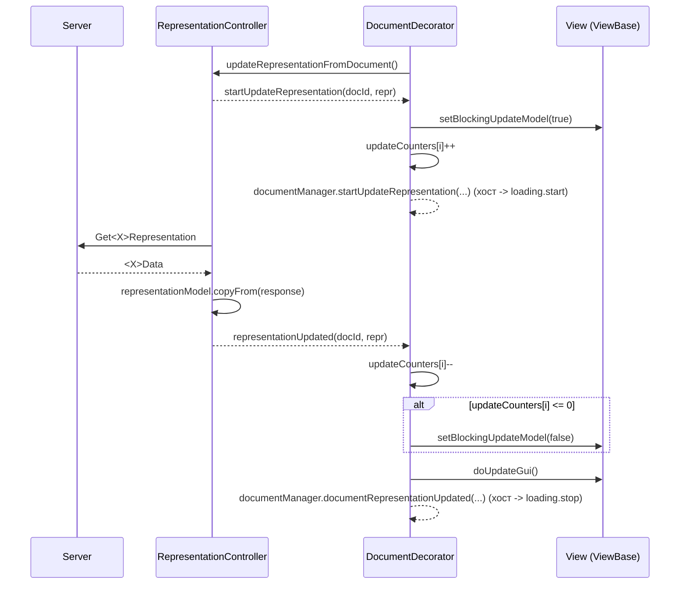
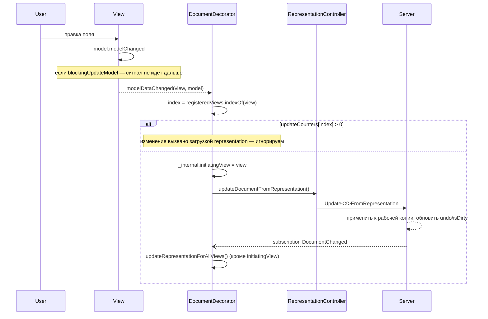

# Клиентские Document Service: подробное описание работы

Документ описывает **клиентскую** часть работы с документами в ImtCore: две существующие
реализации сервиса документов, их модель данных, полный жизненный цикл документа
(открытие, редактирование, undo/redo, сохранение, закрытие), механику обновления
представлений (representation) и поведение при нескольких view на один документ.

Серверная часть (`imtdoc::IDocumentService`, `TCollectionDocumentServiceWrap`,
`imtservergql::CCollectionDocumentServiceControllerComp`) упоминается только в объёме,
необходимом для понимания клиента.

---

## Содержание

1. [Две реализации — общая картина](#1-две-реализации--общая-картина)
2. [Базовые понятия и терминология](#2-базовые-понятия-и-терминология)
3. [Реализация A: локальный `DocumentService`](#3-реализация-a-локальный-documentservice)
4. [Реализация B: клиент серверного сервиса (`DocumentServiceBase` + `GqlBasedCollectionDocumentService`)](#4-реализация-b-клиент-серверного-сервиса)
5. [Механика representation: полный цикл](#5-механика-representation-полный-цикл)
6. [Multi-view: несколько представлений одного документа](#6-multi-view-несколько-представлений-одного-документа)
7. [Undo / Redo](#7-undo--redo)
8. [Имя документа](#8-имя-документа)
9. [Dirty-состояние и индикация](#9-dirty-состояние-и-индикация)
10. [Загрузочные индикаторы (loading)](#10-загрузочные-индикаторы-loading)
11. [Хосты UI: где живут документы](#11-хосты-ui-где-живут-документы)
12. [Сравнительная таблица](#12-сравнительная-таблица)
13. [Тонкие места и типичные ошибки](#13-тонкие-места-и-типичные-ошибки)
14. [Карта файлов](#14-карта-файлов)

---

## 1. Две реализации — общая картина

### A. Локальный сервис — «вся логика на клиенте»

`Qml/imtdocgui/DocumentService.qml`

Документ целиком живёт в QML-процессе:

- модель документа создаёт и загружает `DocumentDataController` (наследник делает
  свои запросы/чтение из коллекции);
- undo-история хранится локально в `UndoRedoManager` (JSON-снимки модели);
- «грязность» (`isDirty`) вычисляется клиентом сравнением JSON текущей модели с
  JSON-снимком последнего сохранения;
- валидация — локальный `DocumentValidator`;
- у одного документа ровно **одно** view.

Сервер (если он вообще есть) видит только «сохрани объект целиком».

### B. Клиент серверного document service

`Qml/imtdocgui/DocumentServiceBase.qml` (абстрактная база, транспорт-независимая)
→ `Qml/imtguigql/GqlBasedCollectionDocumentService.qml` (GraphQL/SDL-транспорт).

Документ живёт **на сервере**:

- сервер владеет рабочей копией объекта, undo-менеджером и флагом `isDirty`;
- клиент хранит только *метаданные* открытых документов и *representation* —
  плоскую SDL-структуру, которую он тянет с сервера и толкает обратно;
- на один документ может быть **много** view (разных `viewTypeId`);
- изменения других пользователей приходят через GraphQL-подписку.

> Есть и третий, «промежуточный» вариант: C++-класс `imtqml::CDocumentServiceController`
> (регистрируется в QML как `DocumentServiceController` из `com.imtcore.imtqml 1.0`).
> Он повторяет API `DocumentServiceBase`, но транспорт делегирует в
> `imtqml::IDocumentServiceBridge`. Штатная реализация моста —
> `imtqml::CDocumentServiceBridge`, который вызывает **in-process**
> `imtdoc::IDocumentService` напрямую. То есть это «серверная» модель работы
> (representation, серверный undo, серверный dirty), но без сети.
> Для QML-кода он взаимозаменяем с `GqlBasedCollectionDocumentService`.

---

## 2. Базовые понятия и терминология

| Термин | Смысл |
|---|---|
| `objectId` | Идентификатор объекта **в коллекции** (то, что видно в таблице/CollectionView). |
| `documentId` | Идентификатор **сессии редактирования**. В варианте A совпадает с `objectId` (или новый UUID для нового документа). В варианте B это отдельный id, выданный сервером; связь `documentId ↔ objectId` хранится в `__internal.openedDocuments[i].objectId`. |
| `documentTypeId` / `objectTypeId` | Тип документа (`"Role"`, `"TenantInfo"`, …). Определяет, какой редактор и какой контроллер представления создавать. |
| `viewTypeId` | Тип представления внутри одного типа документа. Позволяет иметь несколько страниц/редакторов на один документ. |
| **Document** | Рабочая копия объекта. В A — QML-модель, в B — состояние на сервере. |
| **Representation** | Только в варианте B. Плоская SDL-структура (`RoleData`, `GroupData`, …), которую редактор биндит как `view.model`. Это **не** документ, а его «проекция» для GUI. |
| `DocumentDataController` | Только в A. Создаёт/загружает/сохраняет модель документа. |
| `DocumentRepresentationController` | Только в B. Тянет representation с сервера и отправляет обратно. |
| `DocumentDecorator` | Только в B. Связывает документ с набором его view и их контроллеров представления. |

---

## 3. Реализация A: локальный `DocumentService`

### 3.1. Структура данных

```
DocumentService
├── documentsModel : ListModel        // строки: {id, name, typeId, documentData, isNew}
├── documentIndexById : var           // кэш documentId -> index (перестраивается по documentsCount)
└── internal
    ├── m_registeredView            : documentTypeId -> Component (редактор)
    ├── m_registeredDataControllers : documentTypeId -> Component (DocumentDataController)
    ├── m_registeredValidators      : documentTypeId -> Component (DocumentValidator)
    └── m_closingDocuments          : [documentId] — документы, ждущие «сохранить и закрыть»
```

Каждая строка модели содержит `documentData` — экземпляр `singleDocumentDataComp`:

```
singleDocumentData (QtObject)
├── documentId, documentTypeId
├── isNew, isDirty
├── modelReceived, modelInitialized, viewRegistered
├── blockingUpdateModel
├── documentDataController : DocumentDataController
├── documentValidator      : DocumentValidator
├── undoManager            : UndoRedoManager
├── viewComp               : Component
└── view                   : ViewBase
```

### 3.2. Регистрация типов документов

Делается через `DocumentCollectionViewDelegate` (делегат команд CollectionView):

```qml
DocumentCollectionViewDelegate {
    documentManagerId: collectionId          // ищет сервис в MainDocumentService
    documentTypeIds:            ["Service"]
    documentViewsComp:          [serviceViewComp]
    documentDataControllersComp:[serviceDataControllerComp]
    documentValidatorsComp:     [serviceValidatorComp]
}
```

`registerDocumentViews()` вызывает на сервисе:
`registerDocumentView(typeId, comp)` → эмитит `documentTypeIdRegistered(typeId)`,
`registerDocumentDataController(typeId, comp)`, `registerDocumentValidator(typeId, comp)`.

Сам сервис регистрируется глобально в синглтоне `MainDocumentService`
(`registerDocumentService(typeId, documentManager)`), обычно в `DocumentWorkspacePageView`.

### 3.3. Создание нового документа

```
onNew() → createNewObject(typeId) → documentManager.insertNewDocument(typeId, name)
```

Внутри `insertNewDocument`:

1. `documentId = UuidGenerator.generateUUID()`.
2. `createTemplateDocument(documentId, typeId)`:
   - создаётся `singleDocumentData` (по умолчанию `isNew = true`);
   - `viewComp` берётся из `m_registeredView[typeId]` — **если типа нет, возвращается `null`
     и создание молча прерывается** (в консоль пишется ошибка);
   - создаётся `documentDataController` (или `defaultDataController`, если контроллер
     для типа не зарегистрирован — с предупреждением в консоль);
   - создаётся `documentValidator`.
3. `addDocumentToModel(...)` → `documentsModel.append(...)` → сигнал `documentAdded(documentId)`.
4. `documentData.documentDataController.createDocumentModel()` — создаёт пустую модель
   из `documentModelComp`.

Хост UI (`MultiDocWorkspaceView`) по `documentAdded` добавляет вкладку с `documentData.viewComp`.

### 3.4. Открытие существующего документа

```
onEdit() → openDocumentEditor(objectId, typeId, name)
        → documentManager.openDocument(objectId, typeId, name)
```

> Порядок аргументов: **`openDocument(documentId, documentTypeId, name)`**.
> В варианте B порядок обратный — см. §13.

Внутри `openDocument`:

1. Если документ уже открыт (`getDocumentIndexByDocumentId >= 0`) — просто ещё раз
   эмитится `documentAdded(documentId)`; хост переключается на существующую вкладку.
2. Эмитится `documentOpeningStarted(documentId)` → хост включает индикатор загрузки.
3. `createTemplateDocument(...)`, затем `documentData.isNew = false`.
4. На `documentDataController.modelChanged` вешается одноразовый обработчик `onResult`,
   после чего вызывается `documentDataController.updateDocumentModel()`.
5. Когда модель пришла (`modelChanged`), `onResult`:
   - если имя не было передано снаружи — берётся `documentDataController.documentName`;
   - `addDocumentToModel(...)` → `documentAdded(documentId)`.
6. Если `documentDataController` невалиден — сразу `documentOpeningFailed(...)`.

### 3.5. Привязка view к документу

Вкладка загружается лениво. Когда `TabView` создал элемент, хост вызывает:

```
documentManager.setupDocumentView(documentId, view)
```

`setupDocumentView` проставляет во view `documentId`, `documentTypeId`, `documentManager`
и **устанавливает `documentData.view = view`**.

`onViewChanged` в `singleDocumentData`:

- `viewRegistered = true`;
- подключается `view.commandsDelegate.commandActivated → viewCommandHandle`;
- если модель уже получена (`modelReceived`) и ещё не инициализирована — вызывается
  `initModelForView()`.

Порядок «модель ↔ view» может быть любым: `onModelChanged` из
`dataControllerConnections` тоже вызывает `initModelForView()`, если view уже есть.

### 3.6. `initModelForView()` — ключевой момент

```
documentModel = documentDataController.documentModel
documentId    = documentDataController.getDocumentId()

blockingUpdateModel = true
view.model = documentModel
    if (isNew)  updateModel()   // GUI -> модель (заливаем дефолты редактора в модель)
    else        updateGui()     // модель -> GUI
blockingUpdateModel = false

undoManager.registerModel(documentModel)      // снимок = базовая точка undo и «сохранённое состояние»
documentValidator.documentModel = documentModel
modelInitialized = true
modelConnections.target  = documentModel
modelConnections.enabled = true

documentManager.documentOpened(documentId)
```

Важно: `modelConnections` включается **только после** инициализации, чтобы первичная
заливка данных не пометила документ грязным.

### 3.7. Редактирование и `isDirty`

- Любое изменение модели поднимает `modelChanged` вверх по дереву модели.
- `modelConnections.onModelChanged`:
  - игнорируется, если `blockingUpdateModel`;
  - игнорируется, если `undoManager.isTransaction()`;
  - иначе `isDirty = documentManager.documentIsValid(documentData)`.
- `onIsDirtyChanged` → включает/выключает команду `Save` во `view.commandsController`
  и эмитит `documentIsDirtyChanged(documentId, isDirty)`.
- Хост (`MultiDocWorkspaceView`) на этот сигнал ставит/снимает префикс `"* "` в имени вкладки
  (префикс перед применением всегда «отклеивается», чтобы не накапливалось `"* * name"`).

После undo/redo используется другой путь — `checkDocumentModel()`:

```
isDirty = undoManager.isModifiedFrom(documentModel) && documentManager.documentIsValid(...)
```

то есть сравнение JSON текущей модели с JSON «сохранённого состояния».

### 3.8. Сохранение

`saveDocument(documentId)`:

1. Если документ **не** `isDirty` — не делается ничего.
2. Эмитится `documentSavingStarted(documentId)`.
3. Если у view снят `readOnly` — вызывается `view.doUpdateModel()` (GUI → модель).
4. `documentIsValid(document, data)` — вызов `documentValidator.isValid(data)`,
   где `data.editor = documentData.view`. При провале — `documentSavingFailed(documentId, data.message)`
   и выход.
5. `documentDataController.insertDocument()` (если `isNew`) либо `.saveDocument()`.

Контроллер данных по завершении эмитит `saved(documentId, name)`:

- `documentData.isDirty = false`;
- `undoManager.setStandardModel(documentModel)` — новая «точка сохранения»;
- `documentManager.onDocumentSaved(documentId)`:
  - если документ был в `m_closingDocuments` — вызывается `closeDocument(documentId)`;
  - `isNew → false` (и в модели строки тоже);
  - имя строки обновляется из `documentDataController.getDocumentName()` (чтобы
    placeholder-имя нового документа не осталось навсегда);
  - эмитится `documentSaved(documentId)`.

`Ctrl+S` приходит из `DocumentWorkspaceCommandsDelegateBase` (шорткат активен только пока
view видим) → `commandHandle("Save")` → `viewCommandHandle` → `commandHandle("Save")`
→ `documentManager.saveDocument(documentId)`.

### 3.9. Закрытие

`closeDocument(documentId, force)` → `closeDocumentByIndex(index, force)`:

- если документ грязный и `force !== true`:
  - эмитится `tryCloseDirtyDocument(documentId, callback)`;
  - хост показывает диалог «Save all changes?» и вызывает `callback`:
    - `true` → documentId кладётся в `m_closingDocuments`, вызывается `saveDocument()`;
      после успешного сохранения `onDocumentSaved` сам закроет документ;
    - `false` → `isDirty = false` и повторный `closeDocumentByIndex(index)`;
    - `undefined` → отмена, ничего не происходит;
- иначе:
  - documentId удаляется из `m_closingDocuments`;
  - `documentData.destroy()` (в `Component.onDestruction` уничтожаются dataController,
    validator и undoManager);
  - строка удаляется из `documentsModel`;
  - эмитится `documentClosed(documentId)` → хост убирает вкладку.

`closeAllDocuments()` закрывает всё с `force = true` (без диалогов).

### 3.10. Multi-view в варианте A

**Не поддерживается.** `singleDocumentData` имеет ровно одно поле `view`.
`setupDocumentView` перезаписывает его. Сигналы `viewAdded`/`viewRemoved` объявлены,
но не используются.

---

## 4. Реализация B: клиент серверного сервиса

### 4.1. Разделение ответственности

```
          Клиент (QML)                                    Сервер
 ┌───────────────────────────────┐            ┌──────────────────────────────┐
 │ DocumentServiceBase           │            │ imtdoc::IDocumentService     │
 │  • реестр типов/view          │  GraphQL   │  • рабочая копия объекта     │
 │  • метаданные откр. документов│◄──────────►│  • UndoManager               │
 │  • DocumentDecorator          │  + Subscr. │  • isDirty                   │
 │                               │            │  • имя документа             │
 │ DocumentRepresentationController           │  • Get/Update Representation │
 │  • representation model (SDL) │            └──────────────────────────────┘
 └───────────────────────────────┘
```

Клиент **не хранит** документ. Он хранит:

```
DocumentServiceBase.__internal
├── documentTypeEditors      : typeId -> [ {viewTypeId, viewEditorComp, representationControllerComp} ]
├── openedDocuments          : [ documentData ]
├── cachedDocumentNames      : documentId -> name        (имя пришло раньше документа)
├── cachedDocumentObjectIds  : documentId -> objectId    (то же для objectId)
├── documentSaveNameResolvers: documentId -> function
├── pendingDataLoaded        : documentId -> true        (DataLoaded пришёл раньше ответа Open)
├── autoNamedTypeIds         : typeId -> bool            (сервер сам именует документы этого типа)
├── documentManagerActiveView: Item
└── readyEmitted             : documentId -> true
```

`documentData` (создаётся фабрикой `documentDataFactory`):

```
{ id, typeId, name, objectId, isDirty, isNew, isLoading, isClosing,
  views : { viewTypeId -> Item },
  documentDecorator : DocumentDecorator }
```

### 4.2. Регистрация типов и представлений

```qml
documentManager.registerDocumentViewData(
        documentTypeId, viewTypeId, viewEditorComp, representationControllerComp)
```

- повторная регистрация той же пары (`typeId`, `viewTypeId`) — ошибка в консоль и выход;
- по успеху эмитится `documentViewRegistered(typeId, viewTypeId)`.

Способы вызова:

| Хост | Как регистрируются типы |
|---|---|
| `DocCollectionViewDelegate` | `registerDocumentType(typeId, name)` + `addDocumentView(typeId, viewTypeId, editorComp, controllerComp)`; фактическая регистрация — в `registerDocumentTypes()` при появлении `documentManager`. |
| `SingleDocumentTypeRegistrar` | Декларативный массив `views: [{typeId, viewTypeId, editorComp, controllerComp}]` — для экранов без CollectionView. |
| API-клиенты (`GqlBasedUserAdministrationApiClient`, `GqlBasedTenantManagementApiClient`) | Регистрируют пары editor+controller сами при создании своих `GqlBasedCollectionDocumentService`. |

> Если типы регистрирует API-клиент, делегат коллекции должен вызывать **только**
> `registerDocumentType(typeId, name)`, иначе будет двойная регистрация и ошибка.

### 4.3. Активация сервиса

```
setDocumentServiceActiveView(view)
```

Вызывается хостом (`MultiDocumentCollectionView.onDocumentManagerChanged`). При **первом**
переходе `null → view` эмитится `documentServiceActivated()`.

`GqlBasedCollectionDocumentService.onDocumentServiceActivated` → `getOpenedDocumentList()`.
Это восстановление сессии: сервер помнит документы, открытые пользователем ранее.

Ответ обрабатывается в `MultiDocumentCollectionView.onOpenedDocumentListReceived`:
для каждого элемента списка —
`setAutoNamedTypeId`, затем либо `documentCreated(...)` (если `objectId === ""`),
либо `setDocumentName` + `documentOpened(...)` + `setDocumentObjectId(...)`;
затем `getUndoInfo(documentId)` и `documentManagerChanged(DocumentChanged, ...)`.

### 4.4. Открытие документа

```qml
documentManager.openDocument(typeId, objectId)   // ВНИМАНИЕ: typeId первым!
```

1. `getDocumentIdByObjectId(objectId)` — если этот объект уже открыт, эмитится
   `documentAlreadyOpened(existingDocumentId, typeId)` и запрос **не** уходит.
   Хост просто переключает вкладку.
2. Эмитится `startOpenDocument(documentId=objectId, typeId)` → хост включает loading.
3. Уходит мутация `OpenDocument(input: ObjectId{ collectionId, id })`.
4. Ответ `DocumentInfo` → `handleDocumentOpened(...)`:

```
setAutoNamedTypeId(objectTypeId, hasNameProvider)
setDocumentName(documentId, documentName)   // документа ещё нет -> уходит в cachedDocumentNames
__internal.createDocumentData(documentId, objectTypeId, isNew=false)  // подхватывает кэш имени/objectId
setDocumentObjectId(documentId, objectId)
setDocumentIsLoading(documentId, true)
documentOpened(documentId, objectTypeId)
if (isDirty) setDocumentIsDirty(documentId, true)
```

`documentOpened` дополнительно обрабатывается в самом `DocumentServiceBase`
(`onDocumentOpened → createDocumentData`) — повторный вызов безопасен, так как
`createDocumentData` выходит, если документ уже есть.

5. Хост по `documentOpened` создаёт вкладку → §4.6.
6. Сервер грузит объект асинхронно и присылает по подписке
   `DocumentDataLoaded` → `setDocumentIsLoading(documentId, false)` → §4.7.

### 4.5. Создание документа

```qml
documentManager.createDocument(typeId, proposedSourceDocumentId)
```

- `proposedSourceDocumentId` (необязательный) передаётся серверу в
  `DocumentTypeId.proposedSourceDocumentId`; сервер вставит новый объект коллекции
  именно с этим id. Это позволяет клиенту заранее сгенерировать UUID и держать
  `representation.m_id` согласованным с реальным объектом без лишнего round-trip.
- Ответ → `handleDocumentCreated(...)`:

```
setAutoNamedTypeId, setDocumentName
createDocumentData(documentId, objectTypeId, isNew = true)
if (proposedObjectId) setDocumentObjectId(...)
documentCreated(documentId, objectTypeId)
if (isDirty) setDocumentIsDirty(...)
setDocumentIsLoading(documentId, false)   // новый документ грузить нечего
```

`openOrCreateByObjectId(typeId, objectId, proposedId)` — единая точка входа:
пустой `objectId` → `createDocument`, иначе → `openDocument`.

### 4.6. Регистрация view

Когда хост создал экземпляр редактора, он обязан сообщить об этом сервису:

```qml
documentManager.onViewInstanceCreated(documentId, viewItem, viewTypeId)
```

Если `viewTypeId` пустой — берётся первый зарегистрированный для типа документа.

Дальше:

```
documentData.addView(viewTypeId, view)
   → views[viewTypeId] = view
   → signal viewAdded(viewTypeId, view)
        → representationControllerFactory = getDocumentRepresentationControllerFactory(typeId, viewTypeId)
        → representationController = factory.createObject(documentData)
          representationController.documentId = id
          representationController.view       = view
        → documentDecorator.registerView(view, representationController,
                                         updateRepr = !isNew && !isLoading)
→ __internal.maybeEmitDocumentReady(documentId)
```

`DocumentDecorator.registerView` кладёт view/контроллер в параллельные массивы
`registeredViews` / `registeredRepresentation` / `_internal.updateCounters` и эмитит
`viewRegistered`, обработчик которого:

1. `view.setBlockingUpdateModel(true)` — правки GUI пока не должны идти на сервер;
2. `view.model = representationController.representationModel`;
3. подключает `view.commandActivated`, `view.modelDataChanged`, `view.guiUpdated`,
   `view.guiVisibleChanged`;
4. подключает сигналы контроллера представления
   (`representationUpdated`, `startUpdateRepresentation`, `updateRepresentationFailed`,
   `updateDocumentFailed`);
5. синхронизирует доступность команды `Save` из `documentIsDirty(documentId)`;
6. если `updateRepresentation === true`:
   - view **видим** → сразу `representationController.updateRepresentationFromDocument()`;
   - view **невидим** → он кладётся в `_internal.requestUpdateViews` и обновится
     позже, при `guiVisibleChanged(view, true)`;
7. если `view.objectName === "DocumentViewBase"`, во view проставляется
   `representationController` (редактор может дергать обновление сам).

### 4.7. `setDocumentIsLoading(documentId, isLoading)` — узел синхронизации

Это центральная точка, где сходятся «данные готовы» и «view готовы».

```
index < 0 :  если isLoading == false -> запомнить в pendingDataLoaded[documentId]
             (уведомление DataLoaded пришло раньше ответа OpenDocument)

docData.isClosing -> выход (документ уже закрывается)

docData.isLoading = isLoading

isLoading == true и есть pendingDataLoaded[documentId]
   -> удалить запись, немедленно считать isLoading = false

isLoading == false:
   !isNew : documentDecorator.updateRepresentationForAllViews()
   isNew  : для каждого зарегистрированного view —
            если updateCounters[i] <= 0  -> view.setBlockingUpdateModel(false)
            view.doUpdateGui()
   -> signal documentDataLoaded(documentId)
   -> maybeEmitDocumentReady(documentId)
```

`maybeEmitDocumentReady` эмитит `documentReady(documentId)` **ровно один раз**, когда
одновременно выполнено: документ не в состоянии загрузки **и** зарегистрирован хотя бы
один view. Порядок событий значения не имеет.

### 4.8. Закрытие документа

`GqlBasedCollectionDocumentService.closeDocument(documentId)`:

```
если documentIsDirty(documentId):
    эмитим tryCloseDirtyDocument(documentId, closeFunc)   // хост показывает диалог
иначе:
    closeFunc(false)

closeFunc(undefined) -> отмена
closeFunc(true)      -> подписаться на documentSaved/saveDocumentFailed,
                        вызвать saveDocument(documentId);
                        по documentSaved -> closeFunc(false)
closeFunc(false)     -> startCloseDocument(documentId)
                        -> DocumentServiceBase.onStartCloseDocument помечает isClosing = true
                        -> мутация CloseDocument
                        -> handleCloseDocumentResult -> documentClosed / closeDocumentFailed
```

`DocumentServiceBase.onDocumentClosed → __internal.removeDocumentData(documentId)`:
удаляются `pendingDataLoaded`, `readyEmitted`, `cachedDocumentObjectIds`,
`documentSaveNameResolvers` и сама запись из `openedDocuments`.

Хост по `documentClosed` убирает вкладку. `MultiDocumentCollectionView` дополнительно
обрабатывает `closeDocumentFailed`, вызывая свой же `onDocumentClosed`, чтобы вкладка не
«зависла» при ошибке.

Документ может закрыться и **извне** — сервер пришлёт по подписке
`DocumentClosed`, и `GqlBasedCollectionDocumentService` эмитит `documentClosed(documentId)`
напрямую.

> В варианте B **нет** `closeAllDocuments()`. Закрытие всех документов делается циклом
> по `getOpenedDocumentIds()`.

### 4.9. Подписки

`GqlBasedCollectionDocumentService` держит два `SubscriptionClient`:

| Подписка | `gqlCommandId` | Обработка |
|---|---|---|
| Документы | `On<CollectionId>DocumentChanged` | `DocumentDataLoaded` → `setDocumentIsLoading(id, false)`; `DocumentClosed` → `documentClosed(id)`; `DocumentRenamed` → `setDocumentName(id, name)`; **в любом случае** эмитится `documentManagerChanged(operation, objectId, documentId, documentName)`. |
| Undo | `On<CollectionId>UndoChanged` | `undoInfoReceived(documentId, undoSteps, redoSteps, isDirty)`. |

`documentManagerChanged` — это широковещательный сигнал, на который реагируют:

- `DocumentDecorator`: `DocumentChanged` → `updateRepresentationForAllViews()`;
  `DocumentSaved` → вызвать `view.documentSaved()` у всех view, где такая функция есть;
- `MultiDocumentCollectionView`: `DocumentClosed` → убрать вкладку;
  `NewDocumentCreated` / `DocumentOpened` → `setDocumentName(...)`.

Значения операций (`Sdl/imtbase/1.0/CollectionDocumentService.sdl`, enum `EDocumentOperation`):
`NewDocumentCreated`, `DocumentOpened`, `DocumentRenamed`, `DocumentChanged`,
`DocumentSaved`, `DocumentSavedAs`, `DocumentClosed`, `DocumentDataLoaded`.

### 4.10. Механизм override

`DocumentServiceBase` объявляет свойства-переопределения:
`getOpenedDocumentListOverride`, `openDocumentOverride`, `createDocumentOverride`,
`saveDocumentOverride`, `closeDocumentOverride`, `doUndoOverride`, `doRedoOverride`,
`getUndoInfoOverride`.

`GqlBasedCollectionDocumentService` в каждой операции сначала эмитит `start*`-сигнал,
затем — если соответствующий override назначен — вызывает его **вместо** GQL-запроса.
Override обязан сам довести операцию до конца, вызвав нужный
`handleDocumentOpened` / `handleDocumentCreated` / `handleSaveDocumentResult` /
`handleCloseDocumentResult` / `handleUndoResult` / `handleRedoResult`.

---

## 5. Механика representation: полный цикл

Только вариант B.

### 5.1. Контракт `DocumentRepresentationController`

```qml
DocumentRepresentationController {
    property string documentId
    property var    representationModel     // SDL-объект, он же view.model
    property ViewBase view

    signal startUpdateRepresentation(documentId, representation)
    signal representationUpdated(documentId, representation)
    signal updateRepresentationFailed(documentId, message)

    signal startUpdateDocument(documentId)
    signal documentUpdated(documentId)
    signal updateDocumentFailed(documentId, message)

    function updateRepresentationFromDocument() { /* сервер -> representation */ }
    function updateDocumentFromRepresentation() { /* representation -> сервер */ }
}
```

Типичная реализация (см. `GqlBasedUserAdministrationApiClient.__roleControllerComp`):

```qml
function updateRepresentationFromDocument(){
    startUpdateRepresentation(documentId, representationModel)
    getRoleInput.m_id = documentId
    getRoleRequest.send(getRoleInput)          // Query GetRoleRepresentation
}
// ответ:
onFinished: {
    roleReprController.representationModel.copyFrom(this)
    roleReprController.representationUpdated(documentId, representationModel)
}

function updateDocumentFromRepresentation(){
    startUpdateDocument(documentId)
    updateRoleInput.m_documentId = documentId
    updateRoleInput.m_role = representationModel
    updateRoleRequest.send(updateRoleInput)    // Mutation UpdateRoleFromRepresentation
}
```

### 5.2. Направление «сервер → GUI»



Счётчик `updateCounters[i]` нужен, потому что для одного view может быть несколько
параллельных обновлений: блокировка снимается только когда завершились все.

Поиск нужного view выполняется **по совпадению `registeredViews[i].model === representation`**
— то есть по идентичности объекта representation, а не по индексу.

### 5.3. Направление «GUI → сервер»



Проверка `updateCounters[index] > 0` — защита от «эха»: заливка данных из ответа сервера
меняет representation, что снова поднимает `modelChanged`; без этой проверки данные ушли
бы обратно на сервер бесконечным циклом.

`_internal.initiatingView` — защита от лишней перерисовки: view, который инициировал
изменение, при последующем `DocumentChanged` пропускается (его GUI и так актуален).
Флаг одноразовый — сбрасывается в начале `updateRepresentationForAllViews()`.

### 5.4. Ошибки

- `updateRepresentationFailed` → **все** `updateCounters` обнуляются и **все** view
  разблокируются; наверх идёт `documentManager.updateRepresentationFailed(...)`
  (хост показывает ошибку и снимает loading).
- `updateDocumentFailed` → пробрасывается в `documentManager.updateDocumentFailed(...)`.
  Этот же путь используется для **клиентской валидации** в варианте B: у
  `DocumentServiceBase` нет API регистрации валидаторов, поэтому проверки делаются
  прямо в `updateDocumentFromRepresentation()` — при ошибке вызывается
  `PopupManager.addErrorMessage(...)` + `updateDocumentFailed(...)` и запрос не отправляется.

---

## 6. Multi-view: несколько представлений одного документа

Поддерживается только в варианте B.

### 6.1. Регистрация

```qml
documentManager.registerDocumentViewData("Product", "General",  generalEditorComp,  generalCtrlComp)
documentManager.registerDocumentViewData("Product", "Pricing",  pricingEditorComp,  pricingCtrlComp)
```

`getSupportedDocumentViewTypeIds("Product")` вернёт `["General", "Pricing"]` в порядке
регистрации.

### 6.2. Создание в `MultiDocumentCollectionView`

Вкладка документа — это `StackView` (компонент `stackViewComp`):

```
initialize(documentId, documentTypeId):
    viewTypeIds = documentManager.getSupportedDocumentViewTypeIds(documentTypeId)
    для каждого viewTypeId:
        viewComp = documentManager.getDocumentEditorFactory(documentTypeId, viewTypeId)
        addPage(viewComp)
    setCurrentIndex(0)
    синхронизировать loading-оверлей с documentIsLoading(documentId)

onPageAdded(item, index):
    itemViewTypes[viewTypeIds[index]] = item
    item.commandActivated -> onCommandActivated       // переключение страниц по командам
    item.commandsController.setIsToggleable(viewTypeId, true)
    если index === 0 -> setToggled(viewTypeId, true)
    если item.objectName === "DocumentViewBase":
        проставить documentManagerView / documentManager / documentId / documentTypeId
    documentManager.onViewInstanceCreated(documentId, item, viewTypeId)
```

Переключение между представлениями сделано через команды: `viewTypeId` используется как
`commandId`. `onCommandActivated(commandId)`:

- если `commandId` не является одним из `viewTypeId` — игнор;
- иначе `setCurrentIndex(i)` и обновление toggled-состояния кнопок во **всех** страницах.

Обратно: `onCurrentPageChanged` находит `viewTypeId` текущего item и вызывает
`onCommandActivated(viewTypeId)`, чтобы синхронизировать кнопки.

### 6.3. Поведение representation при multi-view

- У **каждого** view свой экземпляр `DocumentRepresentationController` и свой
  `representationModel`. Общего representation нет.
- Все контроллеры зарегистрированы в **одном** `DocumentDecorator` документа.
- При `DocumentChanged` (правка в любом view или изменение другим клиентом)
  `updateRepresentationForAllViews()`:
  - пропускает `initiatingView`;
  - для **видимых** view сразу запускает `updateRepresentationFromDocument()`;
  - для **невидимых** — откладывает, добавляя в `_internal.requestUpdateViews`.
- Когда невидимый view становится видимым (`guiVisibleChanged(view, true)`),
  `DocumentDecorator.onGuiVisibleChanged` подтягивает representation и убирает view
  из `requestUpdateViews`.

Это ключевая оптимизация: в стеке из N страниц запросы уходят только для активной,
остальные подтягиваются лениво при переключении.

- Undo-информация (`undoInfoReceived`) и `documentIsDirtyChanged` применяются ко **всем**
  зарегистрированным view сразу: `setCommandIsEnabled("Undo"/"Redo"/"Save", …)`.

### 6.4. Однодокументный режим

`SingleDocumentWorkspaceContentView` создаёт **только первый** зарегистрированный
`viewTypeId` (`viewTypeIds[0]`) и пересоздаёт его при изменении
`documentId` / `documentTypeId` / `documentManager`. Multi-view там не разворачивается.

---

## 7. Undo / Redo

### 7.1. Вариант A — локальный `UndoRedoManager`

Файл `Qml/imtdocgui/UndoRedoManager.qml`.

- Шаг истории — **полный JSON-снимок** модели (`model.toJson()`).
- Снимок делается **не на каждое изменение**, а после паузы: `onModelChanged` только
  выставляет `m_pendingSnapshot = true` и перезапускает `snapshotTimer`
  (`snapshotDelay`, по умолчанию 250 мс). Это защищает от посимвольной сериализации
  при вводе текста.
- Глубина истории ограничена `maxUndoSteps` (по умолчанию 50); старые шаги вытесняются.
- `flushSnapshot()` принудительно фиксирует отложенный шаг. Вызывается перед
  `doUndo`, `doRedo`, `beginChanges`, `setStandardModel` и в шорткатах.
- Транзакции: `beginChanges()` / `endChanges()`; во время транзакции `m_isBlocked = true`,
  и `onModelChanged` игнорируется. `isTransaction()` используется в
  `singleDocumentData.modelConnections`, чтобы транзакция не помечала документ грязным.
- `registerModel(model)` сбрасывает историю и делает один `toJson()`, который служит
  одновременно базовой точкой (`m_beginStateModel`) и «сохранённым состоянием»
  (`m_standardStateModel`).
- `setStandardModel(model)` вызывается после успешного сохранения — новая точка отсчёта
  «грязности».
- `isModifiedFrom(model)` → `model.toJson() !== m_standardStateModel`.

`doUndo()`:

```
flushSnapshot()
если стек пуст -> выход
m_isBlocked = true
m_redoStack.push(currentModel.toJson())
prev = m_undoStack.pop()
observedModel.createFromJson(prev)
m_beginStateModel = prev
signal modelChanged(); signal undo()
m_isBlocked = false
```

Сигнал `undo` ловится в `singleDocumentData`:

```
onUndo: { checkDocumentModel(); updateGui(); }
```

то есть пересчитывается `isDirty` и GUI перерисовывается из восстановленной модели.

`onModelChanged` менеджера обновляет доступность команд `Undo`/`Redo` во
`view.commandsController`.

Шорткаты `Ctrl+Z` / `Ctrl+Shift+Z` объявлены прямо в `UndoRedoManager` — они сначала
делают `flushSnapshot()`, и только потом проверяют количество доступных шагов
(иначе только что сделанная правка ещё не попала бы в стек).

Есть также `setBlockUndoManager(documentId, isBlock)` и `clearUndoManager(documentId)`
в `DocumentService` — для сценариев, где надо временно отключить трекинг.

### 7.2. Вариант B — undo на сервере

Клиент не хранит истории вообще.

```
DocumentDecorator.onCommandActivated("Undo") -> onUndo()
    -> documentManager.doUndo(documentId, 1)
        -> startUndo(documentId, steps)          (хост -> loading.start)
        -> Mutation DoUndo(CollectionUndoRedoInput{ collectionId, {documentId, steps} })
        -> handleUndoResult(documentId, status)  -> undoDone / undoFailed
```

Статусы ошибок маппятся в человекочитаемые строки: `InvalidUserId`, `InvalidDocumentId`,
`InvalidStepCount`, `Failed`.

После изменения истории сервер присылает:

1. по undo-подписке — `undoInfoReceived(documentId, availableUndoSteps, availableRedoSteps, isDirty)`;
   `DocumentServiceBase.onUndoInfoReceived → setDocumentIsDirty(documentId, isDirty)`;
   `DocumentDecorator` включает/выключает команды `Undo`/`Redo`/`Save` во всех view;
2. по document-подписке — `DocumentChanged`, что приводит к
   `updateRepresentationForAllViews()`, то есть перезагрузке representation
   (`initiatingView` здесь `null`, поэтому обновятся **все** видимые view).

`getUndoInfo(documentId)` — явный запрос состояния (используется, например, при
восстановлении списка открытых документов).

`resetUndo(documentId)` в `GqlBasedCollectionDocumentService` эмитит только
`startResetUndo` — GQL-запрос не отправляется (мутация `ResetUndo` в SDL есть,
но клиентом не используется).

---

## 8. Имя документа

### 8.1. Вариант A

- Имя хранится в роли `name` строки `documentsModel` — это **статический снимок**.
- Источник при открытии: имя, переданное вызывающей стороной (строка таблицы), либо
  `documentDataController.documentName`.
- После сохранения `onDocumentSaved` перечитывает имя через
  `documentDataController.getDocumentName()` и обновляет строку модели, чтобы новый
  документ не остался с placeholder-именем.
- Пустое имя отображается как `defaultDocumentName` (`"<no name>"`).
- Дополнительно `MultiDocWorkspaceView` может получать имя/иконку/описание от
  `ObjectVisualStatusProvider` (`getVisualStatus(objectId, typeId)`), причём
  провизорное имя ставится сразу, чтобы вкладка не «висела» при недоступном провайдере.

### 8.2. Вариант B

Имя хранится в `openedDocuments[i].name`.

```
setDocumentName(documentId, name):
    документ ещё не создан -> cachedDocumentNames[documentId] = name; выход
    иначе -> oldName = ...; name = ...; signal documentNameChanged(documentId, oldName, newName)
```

> `setDocumentName` **не отправляет** мутацию `SetDocumentName`.
> Имя попадает на сервер только вместе с `SaveDocument(input: SaveDocumentInput{documentId, documentName})`.
> Обратный путь — уведомление `DocumentRenamed` по подписке.

#### Поток «сохранить документ без имени»

`DocumentDecorator.onSave()`:

```
если documentManager.hasDocumentNameProvider(documentTypeId):
    saveDocument(documentId, "")            // сервер именует сам
иначе если documentName.length === 0:
    _internal.saveRequested = true
    documentManager.requestDocumentName(documentId, documentTypeId)
иначе:
    saveDocument(documentId, documentName)
```

Хост ловит `requestDocumentName`:

- `MultiDocumentCollectionView` — открывает `InputDialog`; по OK вызывает
  `setDocumentName(documentId, inputValue)`;
- `SingleDocumentWorkspaceShellView` — то же, но если `documentNameInputEnabled === false`,
  имя резолвится через `documentNameResolver(documentId)` (или
  `getDefaultDocumentName()`) и **сразу** вызывается `saveDocument(documentId, resolvedName)`
  без изменения имени документа.

`setDocumentName` → `documentNameChanged` → `DocumentDecorator.onDocumentNameChanged`:

```
documentName = newName
если _internal.saveRequested:
    _internal.saveRequested = false
    onSave()                 // повторный вызов, теперь имя есть
```

`_internal.saveRequested` сбрасывается также в `onStartSaveDocument`, чтобы отменённый
диалог не привёл к «висящему» запросу.

#### Резолверы имени при сохранении

```qml
documentManager.setDocumentSaveNameResolver(documentId, function(id){ return "..." })
documentManager.clearDocumentSaveNameResolver(documentId)
```

`GqlBasedCollectionDocumentService.saveDocument` перед отправкой вызывает
`resolveDocumentNameForSave(documentId, documentName)`: если резолвер зарегистрирован
и вернул непустую строку — используется она. Резолвер автоматически удаляется при
закрытии документа.

Резолверы ставит `SingleDocumentWorkspaceShellView` при
`documentNameInputEnabled === false` — для редакторов, где пользователю не показывают
поле «имя документа».

#### `hasDocumentNameProvider`

`setAutoNamedTypeId(typeId, hasProvider)` заполняется из поля `hasNameProvider`
ответов `DocumentInfo`. Если тип «самоименуемый», клиент никогда не спрашивает имя
и отправляет пустую строку при сохранении.

---

## 9. Dirty-состояние и индикация

| | Вариант A | Вариант B |
|---|---|---|
| Кто определяет | клиент | сервер |
| Как вычисляется | `undoManager.isModifiedFrom(model) && validator.isValid()` либо `documentIsValid()` при каждом `modelChanged` | приходит в `isDirty` из `DocumentInfo` (open/create), из `UndoInfo` и из undo-подписки |
| Где хранится | `singleDocumentData.isDirty` | `openedDocuments[i].isDirty` |
| Сигнал | `documentIsDirtyChanged(documentId, isDirty)` | `documentIsDirtyChanged(documentId, isDirty)` |
| Влияние на UI | префикс `"* "` в имени вкладки (`MultiDocWorkspaceView`), `commandsController.setCommandIsEnabled("Save", isDirty)` | `MultiDocumentCollectionView.updateTabName()` ставит `"* " + name`; `DocumentDecorator` включает `Save` во всех view |

В варианте B `setDocumentIsDirty` вызывается из:

- `handleDocumentOpened` / `handleDocumentCreated` (если `isDirty === true` в ответе);
- `DocumentServiceBase.onUndoInfoReceived`.

---

## 10. Загрузочные индикаторы (loading)

### Вариант A

`MultiDocWorkspaceView` держит счётчик `__localLoadingDepth` и методы
`startLocalLoading()` / `stopLocalLoading()`. Оверлей локальный — блокируется только
рабочая область, а не всё приложение.

Триггеры: `documentOpeningStarted` / `documentSavingStarted` → start;
`documentOpened` / `documentSaved` / `*Failed` → stop.

`SingleDocumentWorkspaceView` вместо этого шлёт глобальные события
`Events.sendEvent("StartLoading" / "StopLoading")`.

### Вариант B

Хост (`MultiDocumentCollectionView`, `SingleDocumentWorkspaceContentView`) эмитит
собственные сигналы `startLoading(documentId)` / `stopLoading(documentId)`, на которые
подписан оверлей конкретной вкладки/страницы.

Триггеры **start**: `startOpenDocument`, `startCloseDocument`, `startSaveDocument`,
`startUndo`, `startRedo`, `startUpdateRepresentation`, а также `documentOpened`
и `documentCreated` (сразу после добавления вкладки).

Триггеры **stop**: `documentDataLoaded`, `documentSaved`, `documentClosed`,
все `*Failed`, а также `documentGuiUpdated` — но **только если**
`!documentManager.documentIsLoading(documentId)`.

Отдельный глобальный оверлей `globalLoading` работает на время
`startGetOpenedDocumentList` … `openedDocumentListReceived`.

Дополнительно `StackView.initialize()` при создании вкладки синхронизирует оверлей
с текущим `documentIsLoading(documentId)` — на случай, если сигналы приходили до того,
как вкладка была построена.

---

## 11. Хосты UI: где живут документы

### Вариант A

| Компонент | Роль |
|---|---|
| `DocumentWorkspacePageView` | Страница-контейнер; создаёт `DocumentService` и регистрирует его в `MainDocumentService` по `pageId`. |
| `MultiDocWorkspaceView` | `TabView` с вкладками документов; поддерживает «прибитые» (`pinned`) вкладки, контекстное меню Close/CloseAll, `ObjectVisualStatusProvider` для имён/иконок. |
| `SingleDocumentWorkspaceView` | `StackView` с «хлебными крошками»; кнопка «назад» закрывает верхний документ. |
| `DocumentCollectionViewDelegate` | Делегат команд `CollectionView`: `onNew` → `insertNewDocument`, `onEdit` → `openDocument`, `onRevision` → диалог ревизий. Поддерживает `isSingleDocumentMode` (перед открытием закрывает все документы). Автоматически закрывает документы удалённых объектов (`dataController.onRemoved`). |
| `MainDocumentService` (singleton) | Реестр `typeId → documentManager`; `openDocument`, `closeAllDocuments`, `saveDirtyDocuments`, `getDocumentDataByView`. |

### Вариант B

| Компонент | Роль |
|---|---|
| `GqlCollectionDocManagerPageView` | Страница коллекции с мультидокументными вкладками. |
| `MultiDocumentCollectionView` | Основной multi-doc хост: `TabView`, где вкладка 0 — `CollectionView` (pinned), остальные — `StackView` с представлениями документа. Подписан практически на все сигналы сервиса. Содержит `NavigableItem` для deep-link `<collectionId>/<typeId>/<objectId>`. |
| `DocCollectionViewDelegate` | Делегат команд `CollectionView` для варианта B: `onNew` → `createDocument` (с диалогом выбора типа, если типов больше одного), `onEdit` → `openDocument(typeId, itemId)`, `onRevision` → диалог ревизий. |
| `SingleDocumentWorkspaceShellView` | Однодокументная оболочка с состояниями `empty` / `loading` / `error` / `content`, заголовком, кнопкой закрытия, `retry()`. |
| `SingleDocumentWorkspaceContentView` | Хост ровно одного view документа; сам создаёт/уничтожает редактор и вызывает `onViewInstanceCreated`. |
| `GqlSingleDocumentPageView`, `GqlSingleDocCollectionPageView` | Страницы-обёртки для однодокументных сценариев. |
| `SingleDocumentTypeRegistrar` | Декларативная регистрация типов без `CollectionView`. |

`MainDocumentService` используется и здесь — `DocCollectionViewDelegate` ищет сервис по
`documentManagerId` (по умолчанию `collectionId`). Если сервис не регистрируется в
`MainDocumentService` (например, его владеет API-клиент), `documentManager` нужно
пробрасывать напрямую свойством.

---

## 12. Сравнительная таблица

| Аспект | A: `DocumentService` | B: `DocumentServiceBase` / `GqlBasedCollectionDocumentService` |
|---|---|---|
| Где живёт документ | в QML-процессе | на сервере (или in-process через `CDocumentServiceBridge`) |
| Что биндится в `view.model` | модель документа | representation (SDL-структура) |
| `openDocument` | `(documentId, documentTypeId, name)` | `(typeId, objectId)` — **порядок обратный** |
| `documentId` | = `objectId` (или новый UUID) | отдельный серверный id |
| Создание | `insertNewDocument(typeId, name)` | `createDocument(typeId, proposedSourceDocumentId)` |
| Undo/Redo | локальный `UndoRedoManager`, JSON-снимки | серверный, мутации `DoUndo`/`DoRedo` |
| `isDirty` | вычисляется клиентом | приходит с сервера |
| Валидация | `DocumentValidator`, `registerDocumentValidator` | API нет — проверки внутри `updateDocumentFromRepresentation()` |
| Multi-view | нет | да (`viewTypeId`) |
| Реестр | `registerDocumentView` / `registerDocumentDataController` / `registerDocumentValidator` | `registerDocumentViewData(typeId, viewTypeId, editorComp, controllerComp)` |
| Активное view | свойство `activeView` | функции `set/getDocumentServiceActiveView` |
| Закрыть всё | `closeAllDocuments()` | нет; цикл по `getOpenedDocumentIds()` |
| Восстановление сессии | нет | `getOpenedDocumentList()` при `documentServiceActivated` |
| Внешние изменения | нет | подписки `OnDocumentChanged`, `OnUndoChanged` |
| Делегат коллекции | `DocumentCollectionViewDelegate` | `DocCollectionViewDelegate` |
| Хост вкладок | `MultiDocWorkspaceView` | `MultiDocumentCollectionView` |

---

## 13. Тонкие места и типичные ошибки

1. **Обратный порядок аргументов `openDocument`.**
   A: `openDocument(documentId, typeId, name)`; B: `openDocument(typeId, objectId)`.
   Ошибка не даёт исключения — документ просто не открывается.

2. **Иерархии несовместимы.**
   `MultiDocumentCollectionView` требует `property DocumentServiceBase documentManager`
   и не работает с `DocumentService`. Аналогично `MultiDocWorkspaceView` не работает
   с `DocumentServiceBase`.

3. **Двойная регистрация view.**
   Если типы уже зарегистрировал API-клиент, делегат должен вызывать только
   `registerDocumentType(typeId, name)`. Повторный `registerDocumentViewData` с той же
   парой (`typeId`, `viewTypeId`) выдаст ошибку и будет проигнорирован.

4. **В варианте B нет валидаторов документов.**
   Клиентские проверки нужно писать в начале `updateDocumentFromRepresentation()`:
   показать `PopupManager.addErrorMessage(...)`, эмитить `updateDocumentFailed(...)`
   и выйти **до** отправки мутации.

5. **`setDocumentName` в варианте B ничего не отправляет на сервер.**
   Имя доедет только со следующим `SaveDocument`.

6. **Порядок «view зарегистрирован» / «данные загружены» не гарантирован.**
   Для этого существуют `pendingDataLoaded` (DataLoaded пришёл раньше ответа Open)
   и `maybeEmitDocumentReady` (готовность = данные + хотя бы один view).
   Для единственно надёжного «документ готов» слушайте `documentReady(documentId)`,
   а не `documentOpened` / `documentDataLoaded` по отдельности.

7. **Для нового документа (`isNew === true`) снятие `blockingUpdateModel`
   выполняется внутри `setDocumentIsLoading(documentId, false)`.**
   Если view регистрируется **после** этого вызова, ветка `viewRegistered` в
   `DocumentDecorator` его не разблокирует (`updateRepresentation` там равен
   `!isNew && !isLoading`, то есть `false`). Практически это значит, что вкладка/страница
   нового документа должна создаваться синхронно по сигналу `documentCreated`, либо
   редактор должен сам вызвать `representationController.updateRepresentationFromDocument()`
   (как это делают `TenantEditor`, `TicketCollectionView`, `TenantCollectionView`).

8. **`updateCounters` защищает от циклов.**
   Не вызывайте `representationModel.copyFrom(...)` вне обработчика ответа —
   изменение representation вне цикла обновления будет воспринято как правка
   пользователя и уйдёт на сервер.

9. **Невидимые view не обновляются сразу.**
   Они попадают в `_internal.requestUpdateViews` и подтягивают representation при
   `guiVisibleChanged(view, true)`. Если ваш редактор скрывается нестандартным способом
   (например, `opacity: 0` вместо `visible: false`), эта оптимизация не сработает.

10. **`ViewBase.doUpdateModel()` / `doUpdateGui()` взаимно блокируются.**
    Внутри `doUpdateGui` выставляется `blockingUpdateModel`, внутри `doUpdateModel` —
    `blockingUpdateGui`. Вложенные вызовы молча выходят.

11. **Undo-снимок отложен на `snapshotDelay` (вариант A).**
    Перед любым чтением истории или проверкой `isDirty` вызывайте `flushSnapshot()`,
    иначе последняя правка ещё не будет учтена (в шорткатах и `doUndo`/`doRedo` это
    уже сделано).

12. **`closeDocument` в варианте B ждёт `documentSaved`.**
    Если сохранение упало, подписка `savedFailedFunc` отключает обработчики, и документ
    остаётся открытым — это осознанное поведение, не «зависание».

13. **Вкладка коллекции не закрывается.**
    В обоих multi-doc хостах вкладка 0 помечена `pinned` и `onCloseTab` для неё выходит
    без действий; в варианте B дополнительно сравнивается `tabId === collectionTabId`.

---

## 14. Карта файлов

### Общие / вариант A (`Qml/imtdocgui/`)

| Файл | Назначение |
|---|---|
| `DocumentService.qml` | Локальный сервис документов (вариант A). |
| `DocumentDataController.qml` | База контроллера данных документа (create/update/insert/save модели). |
| `DocumentValidator.qml` | База валидатора документа (`isValid(data)`). |
| `UndoRedoManager.qml` | Локальная undo-история на JSON-снимках. |
| `MultiDocWorkspaceView.qml` | Мультидокументный хост для варианта A. |
| `SingleDocumentWorkspaceView.qml` | Однодокументный хост для варианта A. |
| `DocumentWorkspacePageView.qml` | Страница-обёртка, создаёт `DocumentService`. |
| `DocumentCollectionViewDelegate.qml` | Делегат команд коллекции (вариант A). |
| `DocumentWorkspaceCommandsDelegateBase.qml` | `Ctrl+S` и проброс команд из view. |
| `MainDocumentService.qml` | Синглтон-реестр сервисов документов. |

### Вариант B (`Qml/imtdocgui/` + `Qml/imtguigql/`)

| Файл | Назначение |
|---|---|
| `DocumentServiceBase.qml` | Транспорт-независимая база: реестр типов/view, метаданные документов, `handle*`-хелперы, `documentReady`. |
| `DocumentDecorator.qml` | Связывает документ с набором view и контроллеров представления; вся логика блокировок и обновлений. |
| `DocumentRepresentationController.qml` | База контроллера представления. |
| `DocumentViewBase.qml` / `DocumentView.qml` | База редактора документа (`objectName === "DocumentViewBase"`). |
| `MultiDocumentCollectionView.qml` | Мультидокументный хост (вариант B). |
| `DocCollectionViewDelegate.qml` | Делегат команд коллекции (вариант B). |
| `SingleDocumentWorkspaceShellView.qml` | Однодокументная оболочка с состояниями. |
| `SingleDocumentWorkspaceContentView.qml` | Хост одного view документа. |
| `SingleDocumentTypeRegistrar.qml` | Декларативная регистрация типов. |
| `imtguigql/GqlBasedCollectionDocumentService.qml` | GraphQL/SDL-реализация транспорта. |
| `imtguigql/GqlSingleDocumentPageView.qml`, `GqlCollectionDocManagerPageView.qml`, `GqlSingleDocCollectionPageView.qml` | Страницы-обёртки. |

### Инфраструктура

| Файл | Назначение |
|---|---|
| `Qml/imtgui/View/ViewBase.qml` | База всех view: `model`, `doUpdateGui`/`doUpdateModel`, блокировки, команды, `modelDataChanged` / `guiUpdated` / `guiVisibleChanged`. |
| `Sdl/imtbase/1.0/CollectionDocumentService.sdl` | Контракт сервиса документов (типы, мутации, подписка). |
| `Include/imtqml/CDocumentServiceController.h/.cpp` | C++-аналог `DocumentServiceBase`, регистрируется в QML как `DocumentServiceController`. |
| `Include/imtqml/IDocumentServiceBridge.h` | Интерфейс транспорта для C++-контроллера. |
| `Include/imtqml/CDocumentServiceBridge.h/.cpp` | In-process мост поверх `imtdoc::IDocumentService`. |
